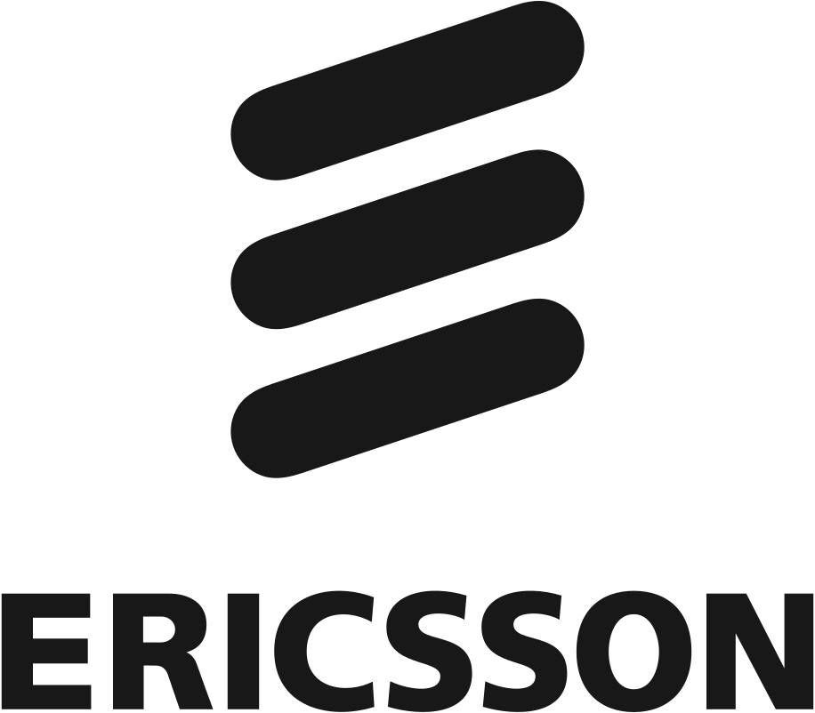
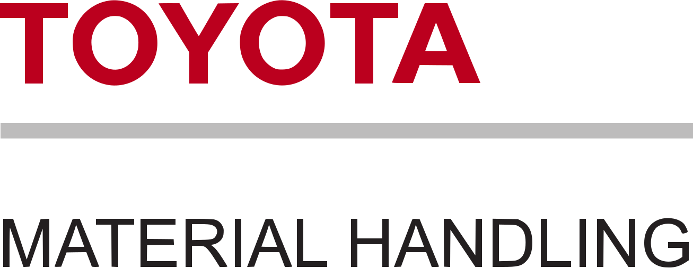
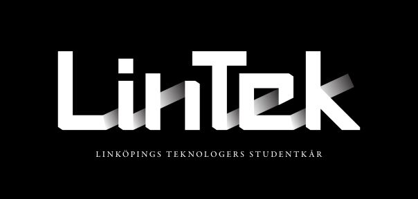
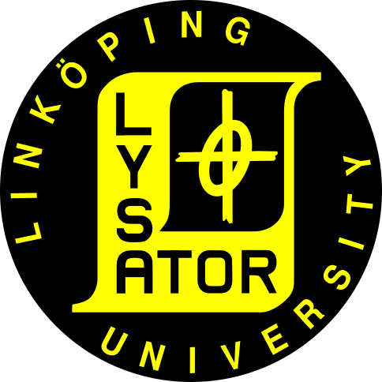

import PartnerCard from "@components/pages/PartnerCard.astro";

<PartnerCard
    title="Huvudsponsor"
>
    
</PartnerCard>

<PartnerCard
    title="Sammarbetspartners"
>
    
    
    
    
</PartnerCard>

<PartnerCard
          title="I stolt samarbete med"
>
    
</PartnerCard>

<PartnerCard
    title="Vi är stolta att vara"
>
    
</PartnerCard>

<PartnerCard
    title="Webbsidan inhyst av"
>
    
</PartnerCard>
