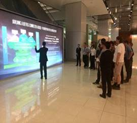
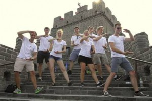
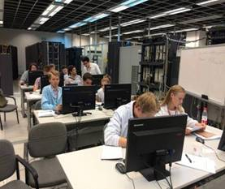
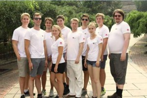

**Är du Sveriges framtid inom telekomsektorn? Nu söker Huawei, världens största telekomleverantör, Sveriges mest lovande och drivna telekomtalanger till en inspirationsresa till Kina under sommaren 2015. Motivera varför just du är en av de personer som kommer säkerställa Sveriges ledande position inom telekom och få chansen att se hjärtat av telekomindustrin under några fullspäckade veckor i juli.**

Sverige är ett av de globala naven inom telekomindustrin. Huawei etablerade sig i Sverige år 2000 och firar sitt 15:e år. Huawei har varit en stark supporter till Sveriges digitala satsning och agenda, med kontor genom hela Sverige.

För att bidra till kunskapsutbyte och inspiration startar Huawei programmet ”Telekomtalang 2015” där tio svenska studenter får åka till Kina i två veckor för utbildning,  inspiration och utbyte.  ”Telekomtalang 2015” är en del av firandet för Huaweis 15:e  år i Sverige och globala program ”Telecom seeds for the future” som sedan 2008 givit studenter från hela världen möjligheten att uppleva Kina ur ett telekomperspektiv.

Vinnarna av ”Telekomtalang 2015” kommer att resa till Kina mellan 26:e juli – 8:e augusti för att vara med en mängd aktiviteter. Huawei står  för resa, kost och logi och en fullspäckad agenda:

En vecka i Beijing:  välkomstmöte,  omfattande upplevelse  av kinekisk kultur och sightseeing  i Beijing osv.

En vecka i Shenzhen:  besök på Huawei HQ,  professionellt träning inom IKT, avslutningsceremonin osv.

Detta är också är värdefult tillfälle att träffas och lära känna andra internationella vinnare från hela världen.

Så var med i vår tävling och få chansenatt  få ett globalt perspektiv på världens mest spännande bransch!

 

**Om tävlingen:**

Huawei vill bidra till att Sverige behåller sin ledande position inom telekom. Nu letar Huawei efter Sveriges mest lovande telekomtalanger som brinner för att bidra till Sveriges utveckling inom sektorn.

Tävlande bidrag utvärderas av en jury bestående av ledande personer från Sveriges telekombransch som vinnarna även kommer få nätverka med innan och efter resan. För att vara med i tävlingen vill vi att du svara på två frågor:

1\. Vad tror du krävs för att attrahera fler unga talanger till ICT-branschen? (Max 300 ord) 2. På vilket sätt tror du att ett deltagande i Sveriges” Telekomtalang 2015” kan bidra till din karriär och varför bör vi välja dig som en av de 10 vinnarna? (Max 300 ord)

**Uppgifter:** Namn Personnummer Studier/betyg Ev övriga studier Ev. relevant arbetslivserfarenhet Övriga meriter

Maila din ansökan märkt ”Telekomtalang 2015” till  [yangyang27@huawei.com](mailto:yangyang27@huawei.com), senast den 20 maj. Vinnarna kommer att kontaktas under vecka 23.

  
