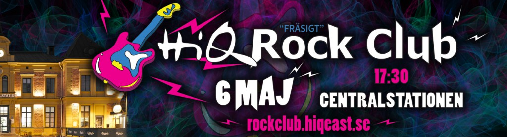

Somliga av er kanske minns, eller inte minns, HiQs legendariska tradition av att sjunga in våren till ljudet av distade gitarrer och falsettsång – HiQ Rock Club!

För de som kanske bara har hört talas om allt galet som tidigare hänt under denna fantastiska kväll, och för alla som har längtat och längtat till nästa allsång på centralen, är det nu äntligen dags för HiQ Rock Club Student Edition 2015 med studenter från Y, D, MT och GDK.

Det kommer bjudas på käk, kunskap, gott att dricka, och självklart mer rock’n’roll än Linköping upplevt sedan Rock Club 2014.

Ett gäng HiQ konsulter kommer också att berätta om några aktuella projekt som bidrar till att göra livet enklare och världen bättre, däribland projektet Smarta Savanner, ett samarbete med LiU, som ska rädda Afrikas noshörningar.

Därefter kommer det vara rock och umgänge som gäller. Kvällens liveband ser till att hålla tempot uppe!

Missa inte detta! Begränsat antal platser så anmäl er så snabbt som möjligt.

Anmälan görs via [http://rockclub.hiqeast.se/register/](http://rockclub.hiqeast.se/register/)

När: Onsdag 6e maj 17:30-24:00 Var: HiQ, Centralstationen, Linköping

Mer info hittar ni på: [http://rockclub.hiqeast.se/](http://l.facebook.com/l.php?u=http%3A%2F%2Frockclub.hiqeast.se%2F&h=YAQE2N0rx&enc=AZOv2FBrxpbZlK4_jxiIwFFjpA5LzjY2-hp4JyPGCa2uIaZuYzmYlk-mhQ0ByQ7yHO4&s=1)
