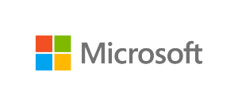

Vi letar just nu efter dig som brinner för teknik och IT, dig som vill göra det lilla extra och inspirera och dela kunskap med andra. Som Microsoft Student Partner är du Microsofts ansikte på campus, vi tillhandahåller den utbildning samt de nätverk och resurser som krävs för att du ska kunna utvecklas och få en unik möjlighet att kickstarta din framtida karriär. <!--more--> Som MSP kommer du att:

- Bygga upp en community på ditt campus
- Anordna event/utbildningar och hackatons
- Bygga upp ett nätverk av likasinnade studenter
- Få unik utbildning av professionella ledare
- Få tillfälle att gå på Microsofts event och konferenser
- Få en unik erfarenhet och ett brett kontaktnät

Ansök med CV och personligt brev till [matander@microsoft.com](mailto:matander@microsoft.com), ange "MSP Sverige" och ditt namn i ämnesraden, vi rekryterar löpande under Juni så skicka din ansökan så fort som möjligt!

Mer information hittar du på: [www.MicrosoftStudentPartners.com](http://l.facebook.com/?u=http%3A%2F%2Fwww.MicrosoftStudentPartners.com%2F&e=ATMX3oBrBIAkmDueaYWZbOo8MOSKaYfaJe31hMxQC7s3Ny4udtdmKbj-jq0HlQ)

 
