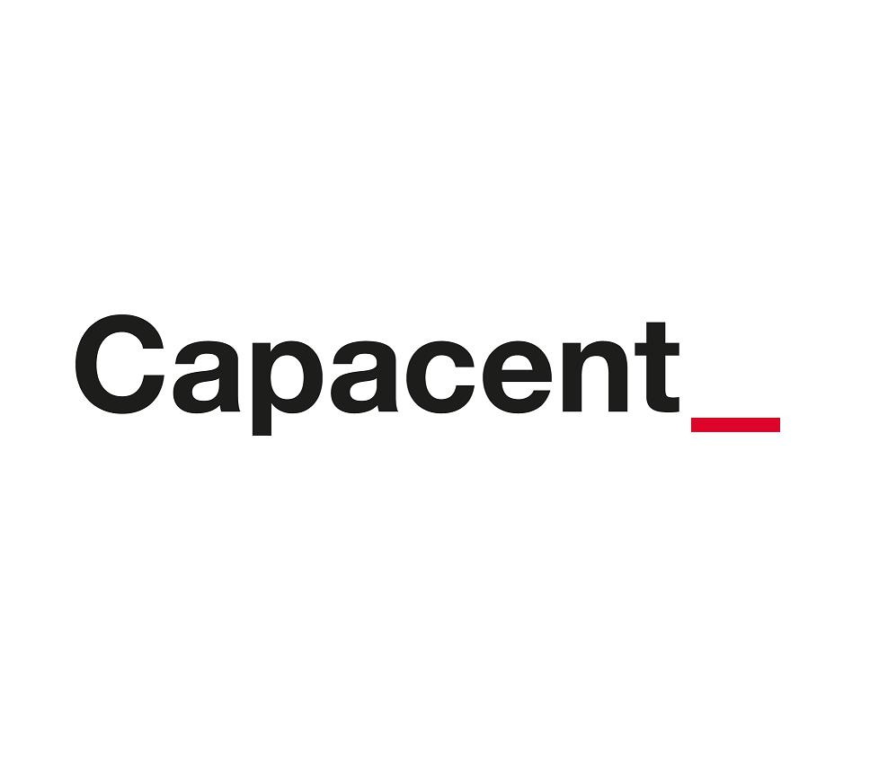

Capacent seeks graduates to Business Intelligence Analyst Rotational Program

The BI-Analyst Rotational Program accelerates your development to become a skilled and sharp Data Warehousing and Business Intelligence consultant. During your first year at Capacent, you will participate in a rotational program covering our different business areas. You will take an active role in our projects – from day one you should be prepared for client contact and to deliver high quality analysis.

The program starts September 2017 and the application deadline is April 2, 2017.

For more information, please visit our website!

http://capacent.se/career/students-bi-consulting

