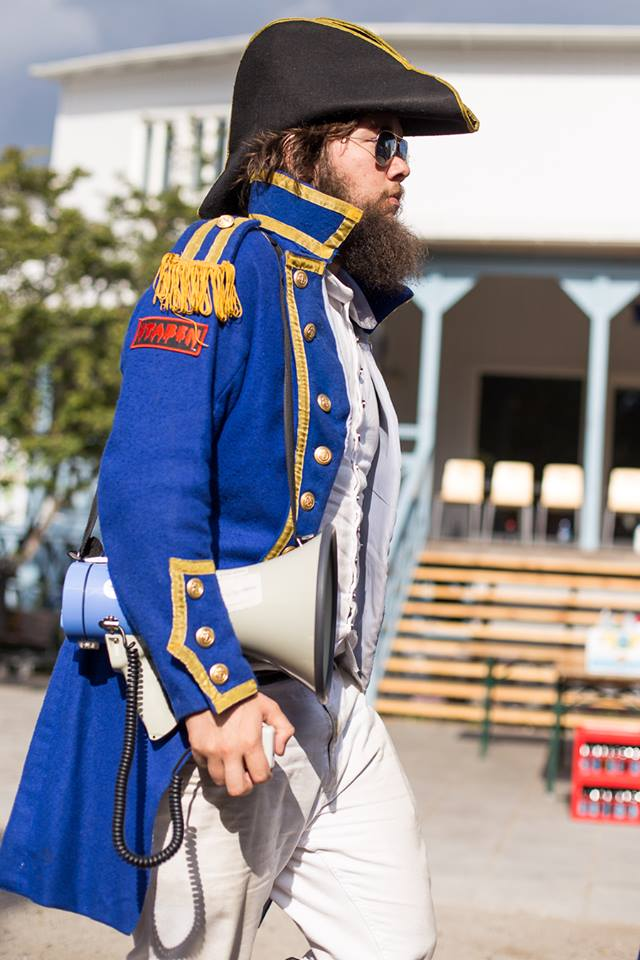

Namn: Alexander Häger Program: D Examensår: TBD (bara rapporten kvar…)

\--

**Vad jobbar du med?**

Backendutvecklare hos Spotify, närmare bestämt i Search-API teamet. Vi tillhandahåller det interna APIet hos Spotify, som gör det möjligt för din Spotify-app att hitta musik när du söker efter musik. Oftast handlar våra uppgifter om att lägga till funktionalitet i vårt API (t. ex. göra Discover Weekly sökbart för alla, så att man får just sin egna playlist), förbättringar i sökindexet (t. ex. hantering av flera olika språk / alfabet) eller saker som hjälper oss monitorera och underhålla våra system.

**Hur ser en vanlig arbetsdag ut?**

Den börjar på tåget från Nyköping kl 07.27. Jag går igenom dagens batch av mail, fixar eventuella administrativa uppgifter och sedan börjar / fortsätter med en uppgift från teamets Trello-board. Kliver in på kontoret tjugo i nio, plockar på mig en ost- och skinkmacka med en kopp te (viktigt) och kodar fram till teamets “stand up” kl 10. Under “stand up” synkar teamet i 20 minuter om vad som gjorts, vad som måste göras under dagen och visar snabba demos av ny funktionalitet. Därefter jobbar jag vidare, kanske i par, eftersom vid det här laget har resten av mitt team tagit sig till kontoret. Sedan plockar jag antingen ihop en lunch i vårt kök eller går ut och käkar på stan. Eftermiddagen brukar spenderas kodande, med varierande antal möten (om allt från teamets interna mål till att hjälpa andra teams att integrera med vårt API). Vid kl 16.55 hoppar jag på tåget till Nyköping igen, och då försöker jag avsluta påbörjat arbete, kolla mail igen och ibland läsa någon intressant artikel för vidareutbildning. Är hemma igen någon minut efter kl 18.

**Vad var roligast under studietiden?**

Mitt engagemang i sektionen är nära hjärtat, styrelsearbete och STABEN. Jag fotograferade även regelbundet på Kårallen och \[hg\], vilket ledde till många roliga kvällar (och väldigt trötta morgnar). Att sitta i LinTeks fullmäktige var också en erfarenhet jag uppskattade. Och när man väl tagit sig till år 4 och 5 var till och med majoriteten av kurserna roliga. Jag vet inte vad som var _roligast_, men något av det här.

**Vad är det bästa med att jobba på ditt jobb?**

Det finns väldigt många anledningar till varför jag gillar att jobba på Spotify, men det som fångar känslan bäst är: när man på en fredag lyckats leverera något som berör 60 miljoner användare och sedan tar hissen upp till kaffeterian för att ta en bärs med kollegorna, samtidigt som ett band går på kör en spelning. Det inte varje fredag förstås, men det händer!

**Roligaste dagen på jobbet?**

Kanske inte just en dag, men i början när jag anställdes gick jag gå på “Intro Days”. Tre dagar då hela Spotifys ledning talade och nyanställda från alla kontor i världen flygs in till Stockholm, för att prata om företaget och vart vi var på väg. Riktigt roligt och engagerande!

Jag som megalur under Häfvet, Nolle-P 2013. Tror jag faktiskt höll mig från att sova under denna tillställning. (Foto: Lingsektionen)

Jag exjobbade i Boston hösten 2016. Väl där passade jag på göra en road trip ner till Miami, där Washington D.C. blev ett stopp.

_**Ett par lite snabbare frågor..!**_ **Din favoritkurs under studietiden?**

Det måste vara PUMen, robotprojektet eller den där kursen man ficka pilla med FPGAer. Någon av dem, kan inte välja!

**Vilken kurs tyckte du var svårast?**

Mätt i antalet skrivna tentor borde det vara flervariabeln, men jag tror att jag hade svårast att förstå mekaniken.

**Håller du kontakt med många från din studietid?**

En del. Hela mitt STABEN har fortfarande kontakt. Resten Facebook-stalkar man åtminstone!

**Vad saknar du mest med studietiden?**

Hm… Jag har inte jobbat tillräckligt länge för att sakna studierna, men umgänget man hade och atmosfären på universitetet är väldigt unikt. Den får man inte nog av!

**Vilket är ditt bästa studietips?**

Inom vårt ämnesområde är det så enkelt att hitta material på nätet. Fattar man inte kursboken ska man inte vara rädd för att YouTube:a efter förklaringar på grundläggande koncept. Sedan brukar kurserna gå djupare än YouTube videos, men de kan hjälpa en att komma igång.

**Om du kunde skicka ett råd tillbaka i tiden till då du var student, vad skulle det vara då?**

Sov mer!
