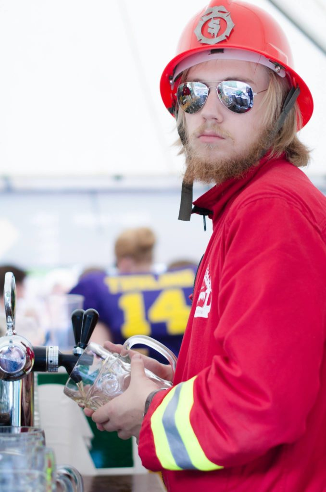
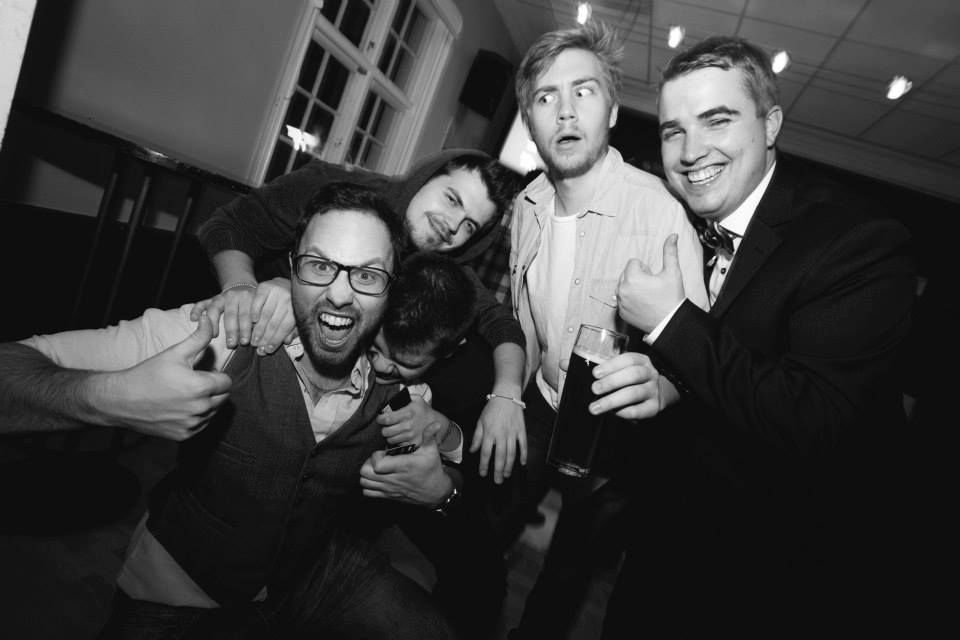

Namn: Ante Wall Program: Innovativ Programmering Examensår: 2015

\--

**Vad jobbar du med?**

Jag är konsult hos Netlight så mitt jobb kan ändras mycket beroende på vart jag är ute på uppdrag och vad det är som jag vill jobba med. Just nu sitter jag på Digital Illusions CE (DICE) som frontendutvecklare. Min uppgifter handlar om att upprätthålla och utveckla användargränssnitt för interna system som används för att hantera och övervaka till exempel spelservrar i olika regioner.

**Hur ser en vanlig arbetsdag ut?**

Jag vaknar och tar gröna tunnelbanan till Medborgarplatsen där DICE kontor ligger. Första tiden på morgon så går jag igenom mail, slackmeddelanden och kollar mitt schema för dagen/veckan både från DICE och från Netlight. Sedan tar jag oftast någon story från JIRA som jag kan sitta med under dagen. Vid 10.30 har vi standup med mitt team. Ibland har jag även det vid 10.00 med ett annat team då jag ibland får hjälpa till med några andra system för att hålla dem uppdaterade och utveckla med nya funktioner. Vid lunch har jag antingen med mig en matlåda eller tar och går till något trevligt matställe på söder. Efter lunch fortsätter dagen med kodande och ibland något möte eller två. Runt 17 så stänger jag ner datorn och åker tillbaka på gröna linjen hemåt.

**Vad var roligast under studietiden?**

Utan tvekan min tid som STABEN general. Även min tid som CC (C-sektionens festeri för de personer som inte var med innan eller under sammanslagningen av sektionerna) var extremt rolig. Men jag kommer även ihåg många roliga dagar/kvällar med personer i min klass och andra kul evengemang som hände.

**Vad är det bästa med att jobba på ditt jobb?**

På Netlight är det att få utvecklas och jobba med de sakerna jag vill. Att ha möjligheten att utvecklas av människor med stor kunskap och att ifall jag vill hellre utvecklas i andra områden att jag har möjligheten att få byta uppdrag till någonting som ger mig den kunskapen och erfarenheten.

På DICE är det extremt kul att få jobba med spel som alltid ha varit en dröm. Att förstå hur man ska utveckla backendsystem för flera miljoner spelare och se hur spelindustrin fungerar inifrån.

**Roligaste dagen på jobbet?**

Roligaste är nästan när jag åker till Netlights huvudkontor och har aktiviteter eller saker med andra Netlightare. Det är en atmosfär med personer som verkligen får upp sin egen energi och man har roligt men även lär sig saker.

Ska man beskriva en dag eller två som har varit helt galet roliga är ju när vi hade den årliga “Summiten” strax innan sommaren och vi sattes på ett flygplan med “destination unknown” och vi förstod när vi landade att vi var i Kroatien och sedan hade konferens där i en dag. Det var superkul, lärorikt och en helt galen upplevelse!

**Du får väldigt gärna skicka en eller ett par bilder om du önskar!**

\[caption id="attachment\_5254" align="alignnone" width="539"\] Här står jag och serverar öl på Muchen Hoben i full karaktär Nolle-p 2014\[/caption\]

\[caption id="attachment\_5255" align="alignnone" width="594"\] En av många kvällar med gott sällskap på \[hg\]\[/caption\]Ett par lite snabbare frågor: **Din favoritkurs under studietiden?** TDDD23: Design and Programming of Computer Games var rolig genom hela kursen, iallafall om man har ett spelintresse. Där fick man verkligen göra något som man bara tyckte var roligt och fick låta sin fantasi flöda!

**Vilken kurs tyckte du var svårast?** Hmm, TDDI09: Systeminstallation var nog dock den kursen som jag lade ner mest tid på tror jag och jag kommer ihåg att den var klurig.

**Håller du kontakt med många från din studietid?** Hela mitt STABEN har fortfarande jättebra kontakt. Några få från klassen annars ser man dem mest på sitt facebook flöde.

**Vad saknar du mest med studietiden?** Gemenskapen, aktiviterna och det allmäna sköna hängen man hade. Atmosfären som finns på LiU som inte går att riktigt beskriva är en stor del som man saknar med.

**Vilket är ditt bästa studietips?** Åk till skolan och sätt er som en grupp. Hemmifrån får man aldrig lika mycket gjort som man vill, och plugga med andra får man både tips, hjälp och trevligt sällskap!

**Om du kunde skicka ett råd tillbaka i tiden till då du var student, vad skulle det vara då?** Engagera dig i sektionen eller andra organisationer så mycket du kan och orkar, det kommer du aldrig att ångra!
