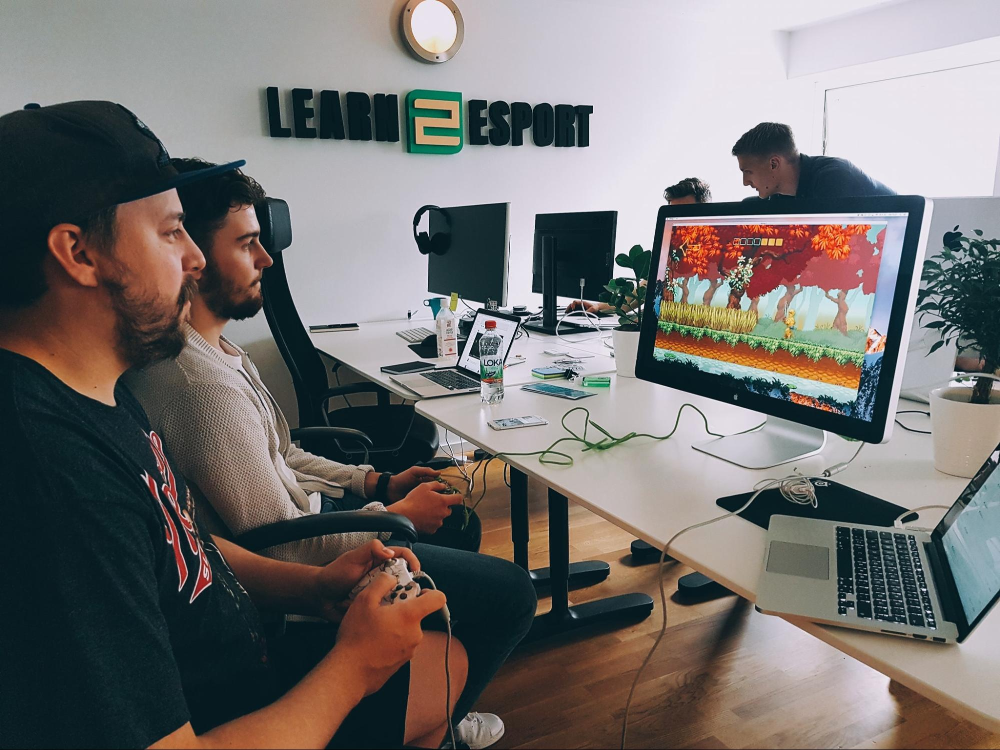
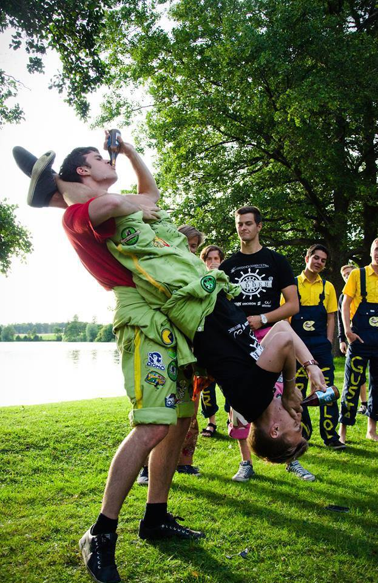

Namn: Dan Andreasson Program: Innovativ Programmering Examensår: 2015

\--

**Vad jobbar du med?**

Jag grundade tätt inpå examen webbyrån SAITS som idag har 6 anställda och där jag är utvecklingschef. På SAITS jobbar vi med många spännande startups och ambitiösa företag men tar även fram egna produkter. En av våra egna produkter som ligger extra varmt om hjärtat är Learn2Esport som är en lärplattform som används av gymnasieskolor som erbjuder esportprofil. Om jag inte är på kundmöte eller projektplanerar så sitter jag förmodligen och skriver kod.

Grundare till esportföreningen Keita Gaming som arrangerar esport-turneringar och idag har över 25 000 medlemmar och 4 000 underföreningar. 2017 valde jag att kliva ned från ordförande-positionen för att fokusera ännu mer på SAITS.

**Hur ser en vanlig arbetsdag ut?**

På SAITS kör vi stenhårt på frihet under ansvar och jag kombinerar detta genom att arbeta hemifrån Dalarna med att pendla till Uppsala-kontoret. Väl på kontoret så börjar jag alltid dagen med en kopp kaffe och planera vad som måste uträttas under dagen. Bortsett den initiala planeringen så är två dagar varandra sällan lik. Det varierar mellan att planera projekt, hitta projekt, sitta ned med designer, spela padel, hjälpa utvecklingsteamet, kul aktivitet eller att koda. När det väl kodas är det mycket Ruby on Rails och React som gäller.

Matlådan ligger förmodligen kvar hemma, så till lunch blir det säkert thaien i samma byggnad.

Under tågresan hem svarar jag på ett par mail, kodar eller kopplar av med en bra bok.

**Vad var roligast under studietiden?**

Många roliga minnen från kravaller och korridorsfester med klasskamraterna, men det roligaste (men kanske också det jobbigaste?) var medan vi byggde upp Keita och den nya turneringsplattformen. Från 8 till 17 i skolan och sen raka vägen till Creactive i Mjärdevi där vi samlades ett gäng studenter och arbetade på Keita som sedan skulle bli en plattform som idag har 25 tusen medlemmar. Vi lyckades få till en sponsordeal med Coolermaster som skickade enormt med utrustning varje månad. Det var riktigt härliga tider!

**Vad är det bästa med att jobba på SAITS?**

Friheten att göra hur jag vill - så länge något blir gjort och utav hög kvalitet. Att ha kollegor som är lika ambitiösa som jag. Att jobba med intressanta kunder och projekt. Att få jobba med e-sportprojekt.

**Roligaste dagen på jobbet?**

När vi lanserat ett projekt som vi arbetat med under en lång tid för att sen gå ut och fira. Eller när vi arbetar och helt plötsligt får för oss att dra och spela padel.

**Du får väldigt gärna skicka en eller ett par bilder om du önskar!**

Paus i arbetet för Niddhog 2-turnering.

Jag (hängandes) och vapendragen Martin (ståendes) utför ett vampyrhäfv för ettan

**Ett par lite snabbare frågor:**

**Din favoritkurs under studietiden?**

Oj, nu ska man komma ihåg vad alla kurser hette.. Språkteknik-kursen (TDDE17) var svår men himla kul! Vi skrev ett program som utifrån twitter förutsåg vinnaren av melodifestivalens andra chansen. Jag gillade generellt många av kurserna!

**Vilken kurs tyckte du var svårast?**

Nätverkskursen (TDTS04) i ettan. Jag envisades med att skriva proxy-labben i C och lade på tok för lite tid på tentaplugg. Var inte förens efter labben som jag förstod att man fick skriva den i ruby.

**Håller du kontakt med många från din studietid?**

Ja, speciellt ett par stycken. Skulle vara grymt kul att träffa alla igen

**Vad saknar du mest med studietiden?**

Svårt att säga - Saknar allt! Brukar säga att min studietid i Linköping var roligaste tiden! Grymt umgänge, alla fester/aktiviteter/kravaller/hoben, kul och intressant att lära sig nya saker man är intresserad av varje vecka.

**Om du kunde skicka ett råd tillbaka i tiden till då du var student, vad skulle det vara då?**

Lär dig Vim, git och att arbeta utifrån terminalen tidigare. Skippa inte föreläsningar även fast det känns “äh, det kan jag redan”.

Hör av dig till [dan@saits.se](mailto:dan@saits.se) om du gillar ansvar under frihet, snabba svängar samt kan (eller vill lära dig) react/rails och är intresserad av att göra exjobb eller komma och jobba med oss efter studierna!
