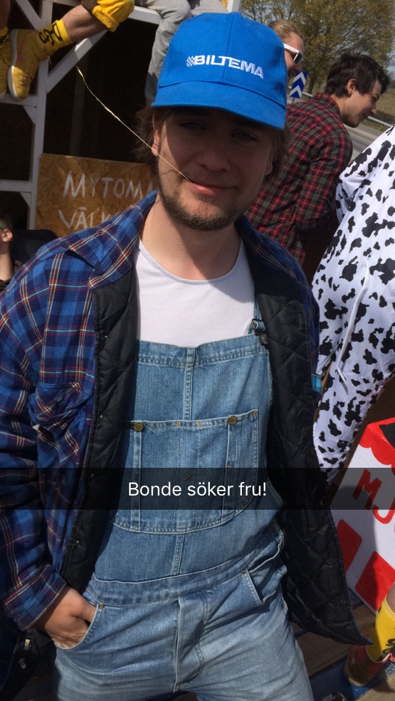

Idag är det dags för vår käre D-Group Chief att intervjuas av valberedningen! Sök till posten själv eller nominera någon annan som du tror skulle passa här: [d-sektionen.se/val](http://d-sektionen.se/val).

## Vem är du?

Mitt namn är Albin Vedin och jag är en pojkvasker på 22 vårar som läser andra året på programmet Innovativ Programmering. Jag gillar sociala tillställningar och intalar mig själv att jag är en duktig deltagare i sådana.

<!--more Läs resten av intervjun →-->

## Kan du berätta om din post som chief i D-Group?

Som chief är du ansvarig för att planera in och hålla i gruppens möten och det är du som närvarar och framför gruppens tankar och värderingar på möten med utomstående parter såsom festerier, studentkårer, kårhus & andra organisationer.

Utöver detta är du ansvarig för en stor del av bokningarna inför fester och det är ditt jobb att ta ett översiktligt ansvar över gruppens välmående och dess arrangemang. Du ska finnas tillgänglig och vara redo att svara på frågor och tackla problem som kan uppstå.

## Vad tycker du är viktiga egenskaper om man vill söka din post?

Tålamod, empati & driv.

## Vad har varit roligast under ditt år i D-Group?

Det absolut bästa är hur många underbara människor man kommer i kontakt med!

## Varför ska man söka posten som Chief?

Det kommer vara den sjukaste berg- och dalbanan du någonsin åkt och du kommer lämnas med en drös fina minnen och en mängd nya vänner.

## Hur mycket tid har du lagt ner i snitt/vecka?

Svårt att säga då det finns intensiva och lugna perioder men om jag skulle försöka uppskatta skulle jag nog säga 10 timmar i veckan, och då räknar jag inte in de sociala delarna som förstås tar upp en del tid.

* * *

\[embed\]http://d-sektionen.se/val\[/embed\]
