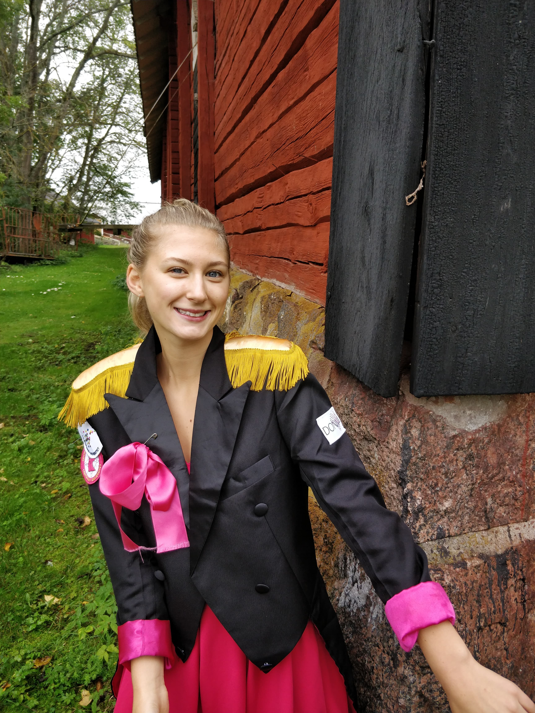

Onsdag innebär en intervju med Donnas Kassör. Vad spännande, läs vidare! Glöm inte heller att söka själv eller nominera någon via [d-sektionen.se/val](http://d-sektionen.se/val).

## Vem är du?

Linn Hallonqvist heter jag och är en 21-årig närking som pluggar andra året på IT. På fritiden gillar jag att spela basket och lyssna på livemusik.

<!--more Läs resten av intervjun →-->

## Kan du berätta om din post som kassör i Donna?

Jag tycker att min post är väldigt lärorik och det känns som att jag kommer ha nytta av det jag lärt mig i framtiden. Jag har hand om Donnas ekonomi, jag fakturerar, bokför och budgeterar. Jag samarbetar med de andra kassörerna på sektionen i form av t. ex. möten då och då, det är skönt eftersom att man kan få hjälp från de andra om det är något man undrar över eller så!

## Vad tycker du är viktiga egenskaper om man vill söka din post?

Att vara strukturerad och trivas med att ta ansvar.

## Vad har varit roligast under ditt år i Donna?

Vår baklängessittning Time Warp! Superkul att få jobba med ett nytt event och få utveckla det precis som vi ville! Att vara med på SACO-mässan och representera tjejer inom teknik tillsammans med de andra damföreningarna var också jätteroligt!

## Varför ska man söka posten som kassör?

För att man kommer ha ett väldigt givande och lärorikt år, få hänga med Donna och lära känna en massa annat nytt folk!

## Hur mycket tid har du lagt ner i snitt/vecka?

Väldigt varierande och svårt att svara på. Det administrativa kassörsarbetet tar en del tid såklart, speciellt i början. Oftast kan jag själv välja när jag ska göra jobbet, det är ju sällan något akut kring just ett event utan mer för- och efterarbete. Så länge man planerar går arbetet inte ut över skolan. Sedan lägger jag också tid på annat som t. ex. lunchmöten, företagsevent och andra grejer vi i Donna gör ihop.

* * *

\[embed\]http://d-sektionen.se/val\[/embed\]
