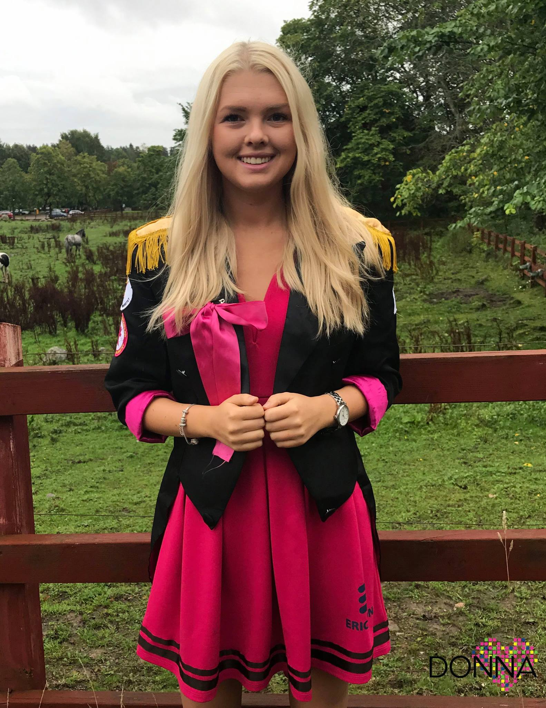

Igår öppnade ansökan till posterna som ska väljas in under vintermötet, och för att ge er en bättre bild av deras arbete så kommer vi att intervjua samtliga sittande på de poster som går att söka till vintermötet. De kommer att släppas nu i dagarna, så se till att hålla utkik! Glöm inte bort att söka själv eller nominera någon annan som du skulle vilja se på posten här: [d-sektionen.se/val](http://d-sektionen.se/val) Först ut i strålkastarljuset är **Louise Lago, PrimaDonna:**

## Vem är du?

Jag heter Louise, aka Lagó/Laggan/PrimaD, är 20 år och kommer ifrån östgötaslättens pärla Ödeshög. Pluggar typ IT2 men läser främst mediavetenskap på filfak. Förutom Donna är jag marknadsföringsansvarig i NärU och hänger en del på Campushallen. Jag flyttade till Linkan för ungefär 1,5 år sedan och älskar att upptäcka nya delar av staden. Andra intressen är politik och mat - jag gör en fantastisk rödbetshummus! Mig hittar du oftast i en soffa i Nettan med en kaffe i handen, kom och häng!

<!--more Läs resten av intervjun →-->

## 

## Kan du berätta om din post som ordförande i Donna?

Som ordförande är det jag som för utskottets talan på möten med kansliet och med de studentföreningar vi samarbetar med. Jag är huvudansvarig för att arbetet flyter på som det ska för alla i Donnastyret. Detta gör jag bland annat genom att styra upp möten där vi bollar idéer, gör fina excel-scheman, har möten med externa parter och planerar kommande och pågående projekt. Som ordförande lär jag mig mycket om ledarskap och projektledning.

## Vad tycker du är viktiga egenskaper om man vill söka din post?

Att man är driven och peppad, har god organiseringsförmåga och gillar kul. Att vara PrimaDonna är lärorikt, utmanande och roligt. Förutsättningarna är ganska enkla: The sky is the limit, och du är personligt ansvarig gentemot ditt styre och sektionen. Något som är väldigt positivt är att som miniDonna (nya kassören och ordföranden) kommer du hänga med Donna 17/18 under våren och anordna massa fantastiskt roliga event. Du kommer få åka på företagsevenemang, få bästa platsen på årets bästa sittning (stay tuned!), hjälpa till att anordna Stilettracet och den årliga vårmiddagen, samt massa annat skoj. Detta tyckte jag var en superbra grej förra året och mina mammor hjälpte mig att förbereda mig väl.

## Vad har varit roligast under ditt år i Donna?

Finns så många bra minnen att välja på, men jag skulle nog hittills säga stilettracet när jag var bebis i våras och TIME WARP-sittningen på \[hg\]. Stilettracet var det första eventet som jag hade ett större ansvar och det var en fantastisk rolig dag! Vår TIME WARP-sittning var ny för i år och mitt favoritminne under kvällen var när alla dansade Time Warp-dansen. Sen att man också har fått hänga med livets Dånnaz och göra massor interna saker är ju en fantastisk bonus!

## Varför ska man söka posten som ordförande?

Det bästa med min post (och Donna i allmänhet) är att jag har väldigt mycket frihet att få utforma sitt arbete och år. Donna har några saker som vi brukar göra varje år, till exempel Kräftis, Damsittsen och Stillett, men annars är det helt upp till mig och mitt styre att göra vad vi tycker är kul och givande. Som PrimaDonna lär man sig otroligt mycket, får lära känna nytt folk från andra föreningar och skapar minnen för livet. Att få vara med i arbetet att öka gemenskapen på sektionen och anordna inspirerande evenemang är något som jag tycker är otroligt roligt. Att få vara ansvarig i projekt från start till genomförande tror jag även är en bra erfarenhet inför arbetslivet. Sedan finns det ju en bonus som donna - du får vara fett snygg på kårallen!

## Hur mycket tid har du lagt ner i snitt/vecka?

Oj, svår fråga då det varierar massor! Beror helt på hur mycket saker vi har på gång samtidigt. Jag skulle säga kanske 2 lunchmöten, ett företagsevent/sittning/gyckel/planering/kul och lite tid på att sitta med mail och drive-dokument. Under större event, till exempel Stilett så lägger man ju mer tid, men man hinner absolut med skolan ändå. Det är väldigt lugnt under tenta-p!

* * *

\[embed\]http://d-sektionen.se/val\[/embed\]
