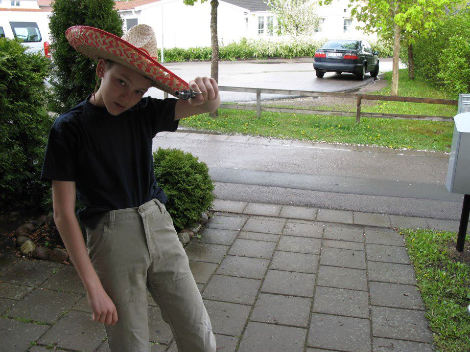

En ny vecka innebär nya intervjuer! På agendan idag står intervjun av sektionens kära ordförande. Sök till posten själv eller nominera någon annan som du tror skulle passa här: [d-sektionen.se/val](http://d-sektionen.se/val).

## Vem är du?

Hej! Jacob Lundberg heter jag, läser 4e året på D-programmet. Jag har hunnit göra en del här på sektionen (D-Group och LINK) vilket innebär att en stor del av min fritid har spenderats med sektionsaktivt arbete. I övrigt spelas det också en del datorspel men framförallt önskar jag att campushallens innebandyturnering drar igång igen i vår så att mitt lag “Big D” åter kan erövra division 3!

<!--more Läs resten av intervjun →-->

## 

## Kan du berätta om din post som ordförande i D-sektionen?

Det är väldigt mycket på gång, sektionen växer så det knakar. Varje dag innebär nya utmaningar på alla möjliga sätt. Posten innebär många spännande möten med lika mycket studenter som företagsrepresentanter. Det är inte helt lätt att säga vad jag faktiskt gör. Det handlar om att sätta upp mål (evenemang/förändringar/aktiviteter) och genomföra dem genom att planera möten, maila och gå på evenemang.

Sektionen är en stor organisation och mer komplex än man kan tro. Jag tror att jag lär mig något nytt varje dag. Sektionen ska kännas som den naturliga platsen för varje D-student och det är fantastiskt att få arbeta med denna utveckling varje dag!

## Vad tycker du är viktiga egenskaper om man vill söka din post?

Gillar du att kommunicera med andra, ta ansvar och leda en grupp för att förbättra studietiden för väldigt många studenter har du det viktigaste egenskaperna för ett framgångsrikt år.

## Vad har varit roligast under ditt år i styret?

Jag har fått möjligheten att träffa många engagerande och inspirerande personer under året vilket dels är motiverande för mig själv samtidigt som jag har fått inspirera andra. Alla personer i styret är fantastiska på många sätt, bara att ha fått träffa dem har varit bland det roligaste!

## Varför ska man söka posten som ordförande?

Det är kul att utmana sig själv, se vad man kan åstadkomma. Vill du leda ett team för att utveckla en komplex och intressant organisation ska du verkligen söka denna post! Glöm heller inte alla människor man får träffa och knyta kontakt med. Sist men inte minst ser det också bra ut på CV:t.

Ta chansen att få utveckla dig själv och en stor förening i det man kan kalla den mest innovativa posten på världens bästa sektion!

## Hur mycket tid har du lagt ner i snitt/vecka?

Det är verkligen olika från vecka till vecka. Ibland är det 5 timmar, ibland är det 15. Med en ordentlig planering blir det mycket lättare!

* * *

\[embed\]http://d-sektionen.se/val\[/embed\]
