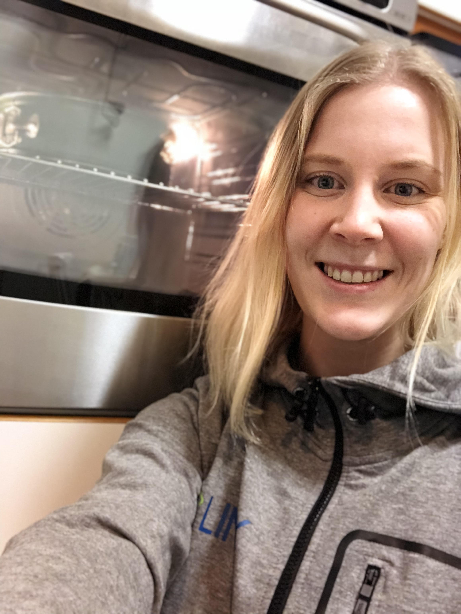

Välkommen att ta del av intervjun med Erica Gavefalk som är sittandes på posten Projektledare för LINK 2017! Sök till posten själv eller nominera någon annan som du tror skulle passa här: [d-sektionen.se/val](http://d-sektionen.se/val).

## Vem är du?

Erica Gavefalk, IT4, älskar att baka, speciellt bröd eller raspberry blondies.

<!--more Läs resten av intervjun →-->

## Kan du berätta om din post?

Som Projektledare för LINK är jag slutgiltigt ansvarig för LINK. Man leder arbetet under våren och hösten för dels styrelse och dels kommitté. Som projektledare får man även träffa ansvariga för andra mässor och samordna mellan varandra.

## Vad tycker du är viktiga egenskaper om man vill söka din post?

Strukturerad och kunna delegera arbete. Eftersom man sitter som ordförande för en styrelse borde man vara bekväm med att leda andra ledare! Man bör också gilla och mejla :)

## Vad har varit roligast under ditt år som projektledare för LINK?

Mässan och banketten! Det var fantastiskt att få se mässan som jag jobbat för sedan januari bli av!

## Varför ska man söka posten?

Man ska projektledare för att man får vara med under hela processen och sätta ihop sin alldeles egna grupp som man får jobba med!

## Hur mycket tid har du lagt ner i snitt/vecka?

Det varierar över året men om jag slår ut så ca 10-15h i veckan. Mer eller mindre allt arbete kan man lägga upp som man vill och det går att planera, för mig har det inte gått ut över skolan!

* * *

\[embed\]http://d-sektionen.se/val\[/embed\]
