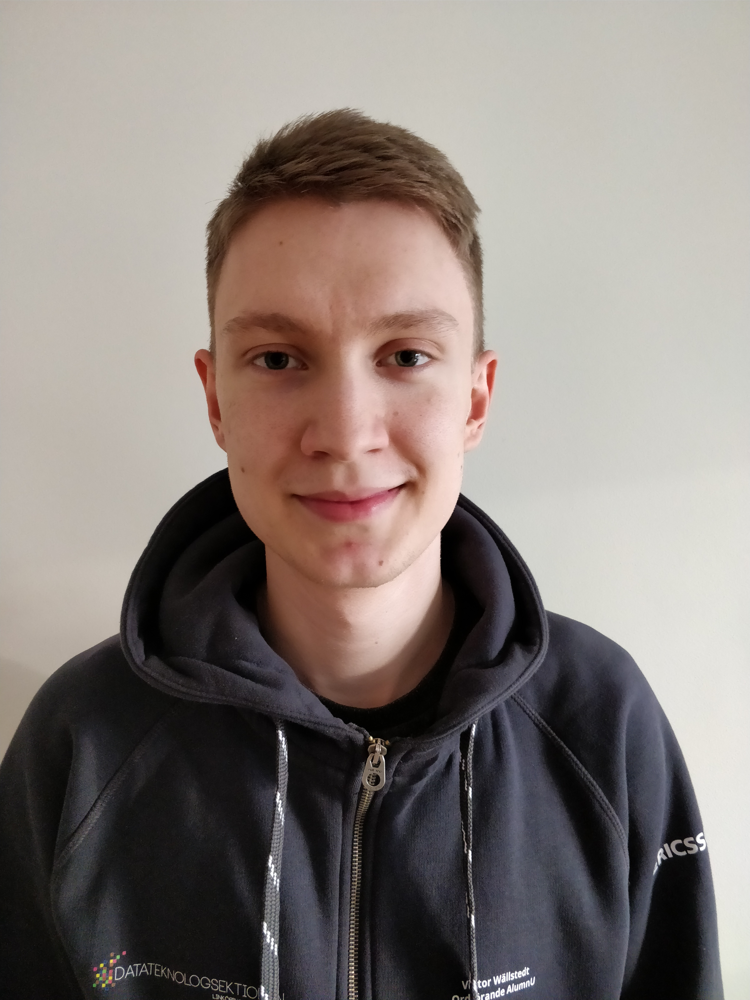

Det börjar vankas påsk! Men först är det Alumniansvarige Viktor Wällstedts tur att svara på valberedningens frågor. Sök själv eller nominera någon till posten här: [d-sektionen.se/val](http://d-sektionen.se/val)

## Berätta lite om dig själv!

Jag är en kille på 23 solsnurr från metropolen Karlskoga som läser första året på säkra system mastern för D-programmet. När jag inte är i skolan brukar jag ändå sitta vid datorn, umgås med min sambo eller ha trevliga kvällar med mina kompisar. <!--more Läs resten av intervjun →-->

## Kan du berätta om din post? (T ex Arbetsuppgifter, utskottets/postens roll etc.)

Att vara alumniansvarig innebär att du leder arbetet i alumniutskottet vars främsta uppgift är att stärka relationen mellan alumner och studenter. De mer rutinmässiga delarna av posten är att agera ordförande på veckomötet varje vecka, ansvara för utskottets välmående, ansvara för att utskottet når sina mål och ansvara för kontinuerlig utvärdering av arbetet. Det är också alumniansvarig som har det övergripande ansvaret för allt som har med utskottet att göra. Som ordförande får man föra utskottets talan i sektionens eget kansli men även i ett alumniråd där man sitter tillsammans med de andra alumniansvariga på tekfak och en ansvarig från LinTek.

## Vilka egenskaper är fördelaktiga att besitta som ordförande för Alumniansvarig?

Det viktigaste är viljan att genomföra event och som ledare behöver man vara driven för att inspirera gruppen och föra arbetet framåt. Alumner är ganska bekväma av sig och för att få med alumner på event behöver därför utskottet någon som inte är rädd för att försöka övertyga gamlingarna om att det är kul att vara med på saker. I och med att man också är övergripande ansvarig för utskottet underlättar det om man har lite koll sen tidigare på hur saker inom sektionen fungerar.

## Vad har varit roligast under ditt verksamhetsår?

Det roligaste är när man får höra från studenterna/alumnerna som besökt ett event hur mycket de uppskattar det. Det gör att allt arbete man lägger ner absolut känns värt det. Givetvis är också sammanhållningen i gruppen och lagandan något som är väldigt roligt att vara en del av.

## Varför ska man söka posten som Alumniansvarig?

Det är både lärorikt och inspirerande att vara i kontakt med alumner, och under året har jag samlat på mig flera alumners tankar och erfarenheter som jag tar med mig. Som alumniansvarig kommer du också få testa på att leda en grupp under en längre tid. Detta innefattar arbete med att sätta upp mål, hjälpa gruppen nå sina mål, och fundera över saker såsom drivkraft, gruppdynamik och sammanhållning. Denna uppgiften är superkul och samtidigt väldigt utvecklande.

## Hur mycket tid har du lagt ner i snitt/vecka?

Det varierar men genomsnittligen ligger det nog i intervallet 5-7 timmar per vecka.

## Om du skulle vara ett djur, vad skulle du då vara och varför?

En björn så jag skulle kunna gå i ide och sova halva året. Även filmen Björnbröder väckte tidigt ett visst intresse av att testa på björnlivet.
