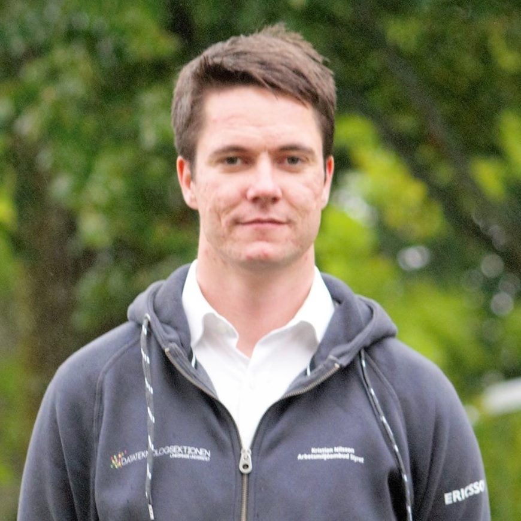

Idag presenterar valberedningen en intervju med Kristian Nilsson, sektionens Arbetsmiljöombud. Sök själv eller nominera någon till posten här: [d-sektionen.se/val](http://d-sektionen.se/val)

## Berätta lite om dig själv!

Jag heter Kristian Nilsson, är 22 år gammal och är uppväxt i Borlänge. Läser nu mitt fjärde år på D programmet där jag börjat på en master inom AI och maskininlärning. På fritiden brukar jag ofta få för mig att lära mig lite värdelösa saker och sen så spelar jag i campushallens innebandyturnering. <!--more Läs resten av intervjun →-->

## Kan du berätta om din post? (T ex Arbetsuppgifter, utskottets/postens roll etc.)

Som arbetsmiljöombud finns det några måsten utöver styrelsearbetet som kommer med och är fantastiskt roligt. Man går på AMO-rådet som är en gång i månaden. Där träffar man representanter från alla sektioner på campus och pratar om hur man kan göra campus bättre för alla. Man sitter med i studentsamverkansgruppen hos IDA där man får träffa representanter från institutionen och påverka.

Samtidigt som man blir arbetsmiljöombud blir man även miljöombud. I miljöombudets uppgifter ligger det att se till så att miljön sköts på ett bra sätt på sektionen och att representera sektionen på möten med andra gröna sektioner.

Att sitta som AMO har varit ganska fritt arbete för mig. Det är några saker som måste göras men sen är det väldigt många saker som kan göras och där är det bara att köra på det som man själv tycker är intressant.

## Vilka egenskaper är fördelaktiga att besitta som AMO?

Vara bra på att lyssna till vad sektionen tycker eftersom du representerar sektionen och ibland även alla andra studenter på universitetet under vissa möten. Har man många egna åsikter kan det också vara en fördel.

Det är en fördel att vara bra på ansikten för man träffar ganska många olika människor och i vissa fall har man tystnadsplikt på det man har pratat om. Då är det väldigt tråkigt om man blandar ihop människor och sprider hemligheter.

## Vad har varit roligast under ditt verksamhetsår?

Det roligaste under året har nog varit att träffa och lära känna så många underbara människor.

## Varför ska man söka posten som AMO?

Man lär sig väldigt mycket om många saker. Väldigt roligt arbete där det är svårt att misslyckas och göra ett dåligt jobb och samtidigt ganska enkelt att göra någonting bra. Det är väldigt få fasta tider så man kan göra mycket av arbetet lite när som helst.

## Hur mycket tid har du lagt ner i snitt/vecka?

Kan nog bäst beskrivas av en Gamma distribution. X ~ Gamma(3; 0,5)

## Om du skulle vara ett djur, vad skulle du då vara och varför?

Jag skulle vilja vara en panda, dom är så runda och fluffiga och verkar inte ha några problem i världen. Dom rullar bara runt, äter och sover.
