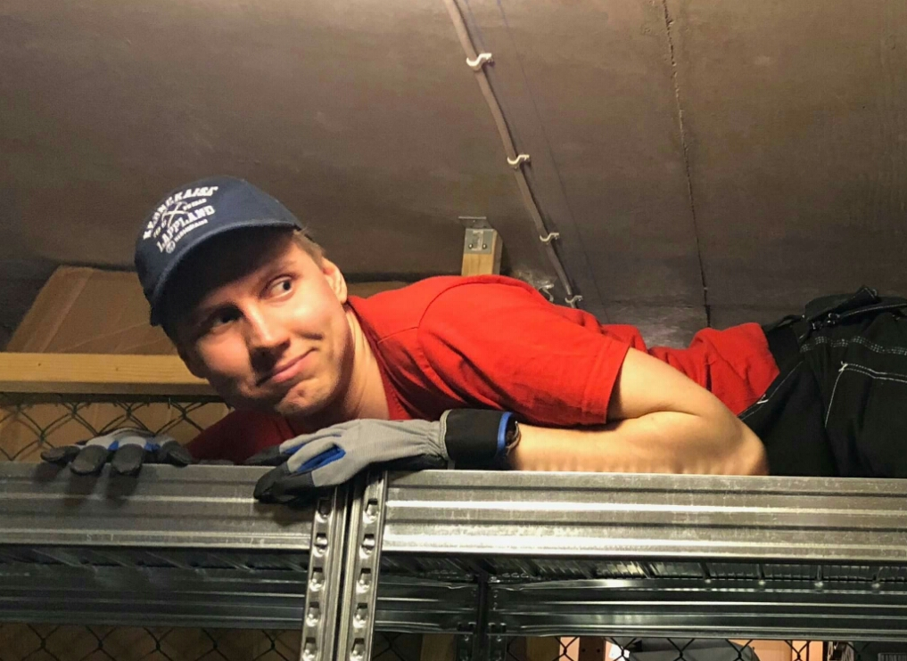

Nästa på tur i rampljuset är Sebastian Bångerius, vår kära Intendent. Sök själv eller nominera någon till posten här: [d-sektionen.se/val](http://d-sektionen.se/val)

## Berätta lite om dig själv!

Jag heter Sebastian Bångerius, pluggar mitt femte år på IT-programmet och är Intendent på D-sektionen. Jag är 23 år och kommer ursprungligen från Karlstad. Jag tycker om att prova nya saker och kan lite om mycket. På min fritid tycker jag det är kul att hänga med alla sköna vänner jag fått genom engagemang i studentlivet, samt flytta otympliga saker på cykel och kasta dart!

<!--more Läs resten av intervjun →-->

## Kan du berätta om din post?

Intendenten sitter både i Styrelsen och som utskottsordförande (MästerWerk) i Werkmästeriet. Intendentens roll är att tillsammans med sitt utskott hantera sektionens gemensamma materiella tillgångar. Det innefattar både inköp, underhåll och försäljning. Exempel på saker som Wermästeriet ansvarar för är: Sektionsrum, förråd, sektionsbilen, datorer, webbshoppen, åvvar, nycklar, werktyg, mm.

## Vilka egenskaper är fördelaktiga att besitta som Intendent?

En Intendent bör vara lyhörd och ordningsam. Att vara "service-minded" kan också vara viktigt, då en ska bistå de övriga utskotten. Det är även bra att tycka om att bära.

## Vad har varit roligast under ditt verksamhetsår?

Det mesta har varit väldigt roligt, men både när A15 och Configura blev färdigrenoverade var riktiga toppar!

## Varför ska man söka posten som Intendent?

Sök Intendent för att det är en post som ger mycket frihet att komma på kreativa lösningar och få växla allt teoretiskt plugg med mer praktiskt arbete; superkul!

## Hur mycket tid har du lagt ner i snitt/vecka?

Mellan 5-10h tar det förväntade arbetet, men det finns alltid något ytterligare som är meningsfullt att göra.

## Om du skulle vara ett djur, vad skulle du då vara och varför?

Jag skulle vara en utter, för att de är bra på [att](https://en.wikipedia.org/wiki/Tool_use_by_sea_otters) [välja rätt verktyg till rätt jobb](https://en.wikipedia.org/wiki/Tool_use_by_sea_otters).
