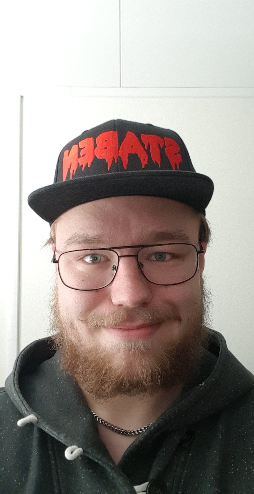

Dags för Albin Andersson, Studienämndsordförande för IT att få sin tid i rampljuset. Sök själv eller nominera någon till posten här: [d-sektionen.se/val](http://d-sektionen.se/val)

## Berätta lite om dig själv

Jag är en snubbe på 21 år som kommer från Hudiksvall och läser tredje året på IT-programmet. Utanför skolan tycker jag om att sitta vid datorn, umgås med folk samt diverse sektionsengagemang. <!--more Läs resten av intervjun →-->

## Kan du berätta om din post?

Att vara SNOrdF innebär att man jobbar för att programmet (i mitt fall IT) ska utvecklas och bli bättre. Detta görs till stor del med hjälp av de kursutvärderingar man utför under året men även tillsammans med alla terminsansvariga i Programplanegruppen och tillsammans med DM-Nämnden. Man sitter även med i LinTeks Utbildningsråd där man har chansen att utbyta kunskap och tips med ens motsvarigheter på andra sektioner.

## Vilka egenskaper är fördelaktiga att besitta som Studienämndsordförande?

Som SNOrdF är det viktigt att kunna hålla en översiktlig bild av arbetet och vad som dyker upp. Detta på grund av att en stor del av arbetet är administrativt och att det då är bra att kunna planera långt i förväg.

Man bör även brinna för, samt ha engagemanget till att driva programmet framåt.

## Vad har varit roligast under ditt verksamhetsår?

Det roligaste har varit att lära känna allt nytt folk. Både från LinTek och från andra sektioner lär man känna människor vilket är väldigt skoj.

## Varför ska man söka posten som Studienämndsordförande?

Det är både mycket lärorikt och roligt samt att man som tidigare sagt lär känna massor med nytt folk. Man får även en djupare insikt i både hur sektionen arbetar och hur organ som till exempel DM-Nämnden och LiU fungerar. Chansen att få vara med att påverka på den här nivån är även en superbra anledning till att söka.

## Hur mycket tid har du lagt ner i snitt/vecka?

Det variera väldigt mycket men snittar väl kanske 3 timmar i veckan.

## Om du skulle vara ett djur, vad skulle du då vara och varför?

En uggla. Jag är väl ingen vidare morgonmänniska. Plus att det hade varit soft att kunna flyga.
