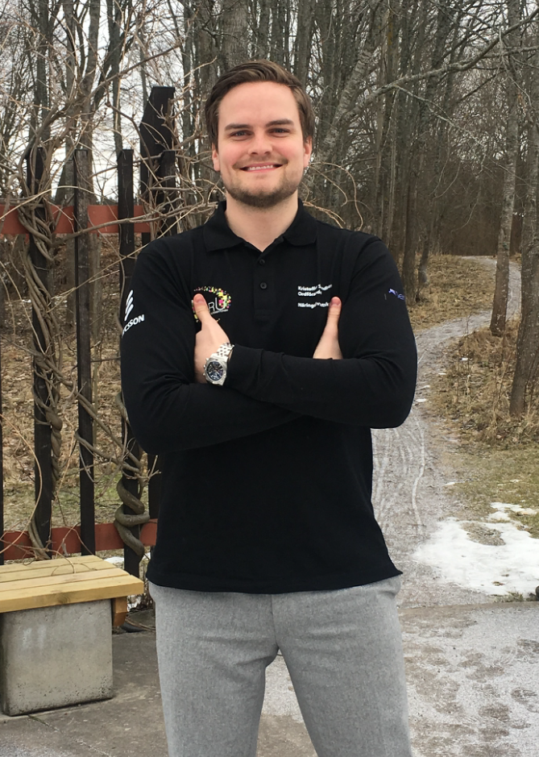

För att pigga upp er vardag kommer här en intervju Kristoffer Sandberg, ordförande för näringslivsutskottet. Sök själv eller nominera någon till posten här: [d-sektionen.se/val](http://d-sektionen.se/val)

## Berätta lite om dig själv!

Hittils har jag hunnit springa upp i 26 år och med rötter i Stockholm. Innan äventyren i Linköping var jag fastkletat i ekonomiträsket ett par år, men bytte spår och läser nu mitt andra år på IT med ett basår i ryggsäcken. Sedan dess har jag engagerat mig i Näringslivsutskottet och några andra mindre åtaganden. Träning och personlig utveckling tillhör intresseområden. Men för att inte utvecklas för mycket eller må för bra så blir det ibland några vändor på KK, Flamman eller Kårallen emellanåt. Festa är kul! <!--more Läs resten av intervjun →-->

## Kan du berätta om din post? (T ex Arbetsuppgifter, utskottets/postens roll etc.)

Som Näringslivsansvarig ansvarar du för att bygga nya och upprätthålla många av sektionens goda relationer med näringslivet. Rollen innebär bland annat att representera Datateknologsektionen vid olika event, mässor och andra forum samt att leda ett team inom Näringslivsutskottet. Näringslivsutskottet i sin tur verkar för att tillsammans med företag på olika sätt presentera den enskilde studentens möjligheter i näringslivet. Det finns väldigt många intressanta företag inom Data/IT så förutsättningar för lyckade event finns verkligen!

## Vilka egenskaper är fördelaktiga att besitta som NärA?

I rollen som Näringslivsansvarig är du framgångsrik om du har ett affärsorienterat tänk, är en god kommunikatör och har en naturlig fallenhet inom att leda/inspirera andra. Eftersom det ska planeras i kalendrar och synkroniseras med andra verksamheter så krävs det också en del struktur. Det är även bra att vara lyhörd så att man kan anpassa många detaljer som tilltalar sektionens medlemmar. Mycket av detta kommer man lära sig i rollen och man har ju dessutom ett helt team som stöttar en och att bolla idéer med. Teamwork löser allt!

## Vad har varit roligast under ditt verksamhetsår?

Helt klart att träffa så många intressanta människor! Det har varit väldigt lärorikt och från engagemanget följer fina vänskaper som garanterat hänger kvar. Jag rekommenderar varmt att engagera sig oavsett förening/utskott, det finns så mycket bra som kommer på köpet och känslan av en samhörighet tror jag är viktig.

## Varför ska man söka posten som NärA?

Svaret är enkelt. Du söka posten för att den är så extremt rolig och lärorik! I rollen kommer du slipa på färdigheter som inte din vanliga utbildning alltid kommer åt. Nämligen affärsmannaskap, professionalism och förmågan att mingla/nätverka är några goda exempel. Sök och bygg ut din verktygslåda. Det kommer bli utmanande och roligt, jag lovar.

## Hur mycket tid har du lagt ner i snitt/vecka?

Tidsåtgången är väldigt dynamisk. Det är i mångt och mycket ett inflöde som hanteras, dvs att företagen själva tar kontakt, så det är direkt korrelerat med hur detta flöde ser ut. Men slår man ut det i snitt så är det ungefär en arbetsdag per vecka. Men det går såklart att anpassa till vad man själv vill eller har för arbetsupplägg. För mig har det blivit så roligt och viljan att driva verksamheten framåt har blivit så stark att det antagligen har stoppats in fler timmar än direkt nödvändigt.

## Om du skulle vara ett djur, vad skulle du då vara och varför?

Om Barba inte är ett djur så får det bli en katt, eftersom katten Gustaf är Barbas kompis. Katter är ju inte bara listiga och smidiga, de har 9 liv också så med det sagt är valet givet. I ett av mina andra liv hade jag garanterat sökt Näringslivsansvarig igen. :)
