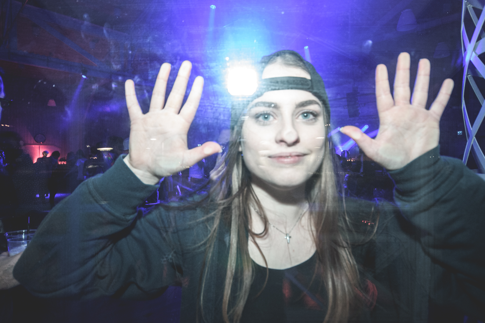

Här kommer en intervju med Juliette Winneroth, ordförande för aktivitetsutskottet! Sök själv eller nominera någon till posten här: [d-sektionen.se/val](http://d-sektionen.se/val)

## Berätta lite om dig själv!

Hejsan! Jag heter Juliette, jag är 20 år gammal och går just nu andra året på D. När jag började på här på LiU valde jag att söka till AktU och har sen dess fastna för att vara sektionsaktiv och hitta på roliga saker mer andra sektionsmedlemmar. Annars på min fritid gillar jag att umgås med trevliga människor, äta god mat och då och då titta på hockey. <!--more Läs resten av intervjun →-->

## Kan du berätta om din post?

Som Ordförande för Aktivtetsutskottet (eller aktivitetshanterare om man så vill) får jag göra en massa roliga och en hel del planering. I stor grad handlar min post om att driva projekt framåt och se till att de saker som behövs för att ordna evenemang finns tillgängliga, så som lokaler. Då vi planerar och håller igång många event samtidigt gäller det att kunna hålla många bollar i luften och se till att planeringen av alla event går framåt. Utöver planering av evenmang så spenderar jag tid på dagordningar och maila olika människor. Kommunikation är en stor del av min post då vi har mycket sammarbeten med andra utskott och kontakt med andra arrangörer, särskilt inför större event som typ CSN eller pi-balen.

## Vilka egenskaper är fördelaktiga att besitta som aktivitetshanterare?

Jag tror att en bra egenskap att ha som ordförande för AktU är att man är organiserad. Periodvis är det mycket som ska göras på olika håll och det är synd om man glömmer bort något som behövs göras. Dock tror jag att de viktigaste egenskaperna är att man är kreativ, vill hitta lösningar och vill engagera sig för att ordna roliga saker för sektionen.

## Vad har varit roligast under ditt verksamhetsår?

Det bästa med mitt verksamhetsår har varit att få lära känna och arbeta med så många olika människor från olika sektioner och årskurser. Att få sitta med i kansliet har också varit både roligt och lärorikt. Jag har fått lära mig både mer om att planera olika typer av evenemang och om hur sektionen fungerar. Utöver det här jag fått hänga med en toppen grupp hela året och hittat på mycket roligt tillsammans.

## Varför ska man söka posten som Aktivitetshanterare?

Jag tycker att man borde söka AktU ordförande om man vill ha en engagerande ledarroll där man har möjlighet att hitta på i princip vad som helst. Om man vill ha möjlighet att samarbeta med massa andra roliga människor och samtidigt lära sig mycket om planering och sektionen.

## Hur mycket tid har du lagt ner i snitt/vecka?

På min post har jag lagt allt ifrån 1 till 10 timmar i veckan helt beroende på vilka evenemang som varit i planering och hänt en specifikt vecka.

## Om du skulle vara ett djur, vad skulle du då vara och varför?

Om jag skulle vara ett djur skulle jag vara en ekorre, mest bara för att få klättra i träd utan att se dum ut och bli utskälld.
