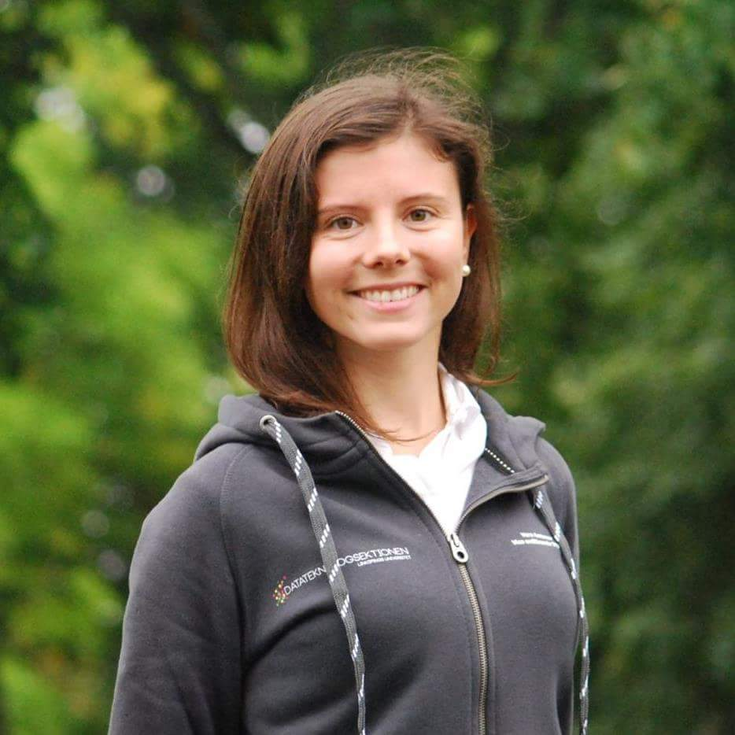

Äntligen helg och en intervju från vår självaste vice ordförande Vera Antonov, det kan inte bli bättre. Sök själv eller nominera någon till posten här: [d-sektionen.se/val](http://d-sektionen.se/val)

## Berätta lite om dig själv!

Läser andra året på IP (Innovativ programmering), 23årig entreprenör som kör långdistanstriathlon när jag inte kodar, går på roliga möten eller äter mat. <!--more Läs resten av intervjun →-->

## Kan du berätta om din post? (T ex Arbetsuppgifter, utskottets/postens roll etc.)

Jag är Vice ordförande och det innebär att jag är helt enkelt vice ordförande för sektionen vilket är en post i styret. Mina fasta delar av posten är att jag ska hålla i sektionsaktivas (kul!) samt leda sektionens kansli vilket är forumet där alla förtroendevalda träffas och diskuterar frågor (kul!). Förutom detta är min roll att avlasta ordförande och vara ett ansikte framförallt inom sektionen. Det finns även plats för att dra igång egna projekt med något man själv brinner för, i mitt fall var det att styra upp rekryteringen inom sektionen med exempelvis en rekryteringspolicy samt att jag har föreläst på gymnasiemässor för att få fler tjejer att välja datautbildningar.

## Vilka egenskaper är fördelaktiga att besitta som Vice Ordförande?

Att vara flexibel, kunna lösa situationer man inte tänkt på på ett snyggt sätt och kunna medla. Att vara social och ha koll på sektionen är absolut ingen nackdel då många frågor kretsar kring utskottens arbete. Dock inget måste då jag inte varit sektionsaktiv innan och det gått bra ändå, men det har varit en hel del att lära sig :)

## Vad har varit roligast under ditt verksamhetsår?

Helt klart att anordna sektionsaktivas. Sjukt roligt uppdrag att få tacka alla som engagerar sig och gör så mycket bra inom sektionen. Tagga fuckoff!

## Varför ska man söka posten som Vice Ordförande?

För att du får en grym inblick i sektionen, får träffa massa folk och har all möjlighet att påverka frågor du tycker är viktiga genom posten i styret.

## Hur mycket tid har du lagt ner i snitt/vecka?

Ca 5-8 h per vecka. Varierat.

## Om du skulle vara ett djur, vad skulle du då vara och varför?

Delfin. Vill kunna simma snabbt och vara smart.
