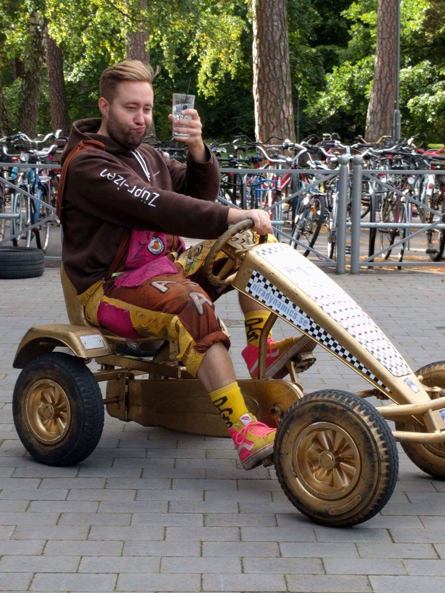

Här kommer en intervju med pubutskottets ordförande Adam Andersson. Sök själv eller nominera någon till posten här: [d-sektionen.se/val](http://d-sektionen.se/val)

## Berätta lite om dig själv!

Jag heter Adam Andersson, 27 år gammal och och pluggar tredje året på mjukvaruteknik. På fritiden tycker jag om att rigga Gasquen, hacka grönsaker och göra power-point presentationer. <!--more Läs resten av intervjun →-->

## Kan du berätta om din post?

Min post går ut på att strukturera upp utskottets arbete, detta kan bl.a. innebära att se till att lokal är bokad till våra lunchmöten, fixa matbeställningar till Axfood samt hålla koll så att allting flyter på bra under puben.

## Vilka egenskaper är fördelaktiga att besitta som ordförande för pubutskottet?

De egenskaper som är bra att ha för min post är att man ska vara en person som kan strukturera upp arbetet både för sig själv och för andra. Man ska vara en ledartyp som kan känna av läget och anta den roll som behövs för stunden.

## Vad har varit roligast under ditt verksamhetsår?

Det roligaste under mitt år har helt enkelt varit att umgås med det sköna gänget som är PubU!

## Varför ska man söka posten som Pubutskottsordförande?

Därför att det är ett engagemang där man får utveckla sin ledarroll och bli bättre på att strukturera upp arbete.

## Hur mycket tid har du lagt ner i snitt/vecka?

Utöver att man arbetar en pub i månaden (ca 8-22 dvs 14 timmarspass) så har jag nog lagt ca 4 timmar i veckan i snitt.

## Om du skulle vara ett djur, vad skulle du då vara och varför?

Djur får ju inte vistas i köket så jag passar nog på den...
