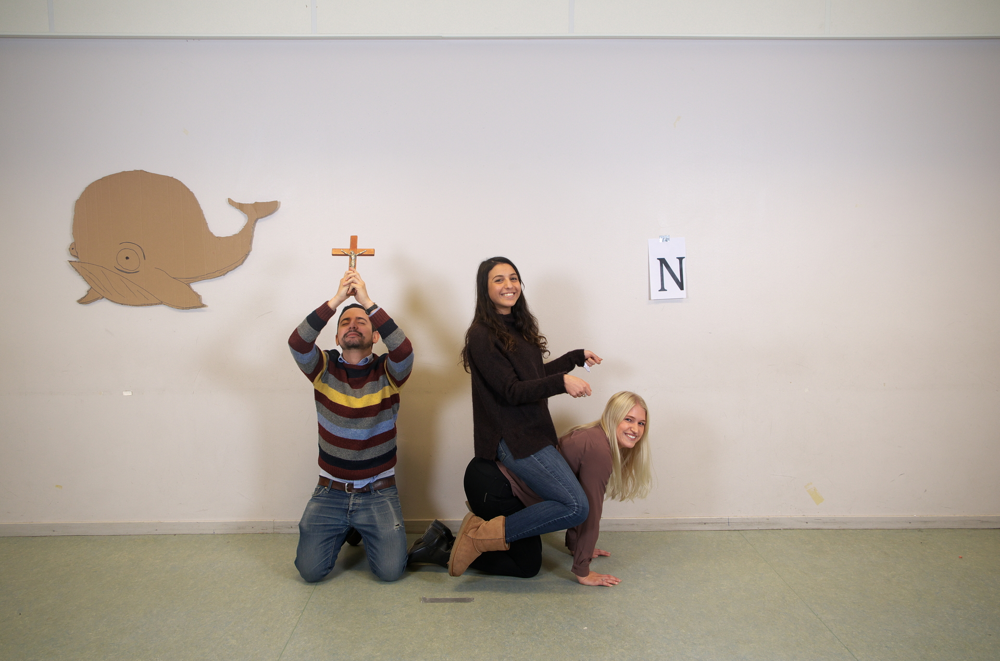

Här kommer en intervju med Rosanne Rabin, ordförande för valberedningen! Sök själv eller nominera någon till posten här: [d-sektionen.se/val](http://d-sektionen.se/val)

## Berätta lite om dig själv!

Jag är medlem i Donnastyret, valberedningen och läser lite nationalekonomi vid sidan av huvudstudierna som givetvis är på D-sektionen. Utöver min vardag i Linköping tycker jag mycket om att umgås med familjen, och när det finns tid även med vännerna hemma där taklösa jargonger och att interna betts med jobbiga straff hör till det vanliga.

Egenskaper jag tycker säger mycket om mig är självdistans, överseende och passionerad. Jag är en opinionsbildare i mångt och mycket, och är inte speciellt tävlingsinriktad förutom när det gäller sport och omgivningen andas glädje eller engagemang och tävling. Något jag tycker mycket om är meditation och mindfullness. Många skämtar om dessa träningsformer för fokus-, medvetenhet men jag är en gedigen och förälskad förespråkare av dessa.

<!--more Läs resten av intervjun →-->

## Kan du berätta om din post? (T ex Arbetsuppgifter, utskottets/postens roll etc.)

Som ordförande för valberedningen ansvarar du för att de ansvarsuppgifter som åligger valberedningen att utföra enligt stadgar genomförs. Du får även lov att tidigt definiera i vilken riktning valberedningen ska arbeta vilket kommer komma att stå i grund för vad som ska göras vid sidan av de satta uppgifter som valberedningen har. Med det sagt har vi detta år rent praktiskt arbetat med två delar: Den första delen omfattar utveckling av valberedningens verksamhet samt arbetet som rör nomineringsprocesserna och hur vi kan skapa de bästa förutsättningarna för att arbeta opartiskt och minimera risker för jäv/egenintresse och därtill bidra till rättvisa val och processer. Den första delen rör även hur vi kan utveckla en ökad transparens och även egen kunskap och kompetens inom intervjuteknik. Detta är saker vi lagt fokus vid och är endast exempel på saker man kan göra och arbeta med. Den andra delen som rör nomineringsprocessen är att skapa målbilder för de poster som ska tillsättas. Dessa uppgifter innefattar att göra formulär, intervjuer på facebook, frågeformulering inför intervjuer, håller i intervjuer, diskussionsmöten, m.m. Jag vill notera att dessa uppgifter inte är något som jag själv arbetar med utan det gör vi som grupp där vi försökt variera arbetsuppgifter och fördela tid jämnt så gott det går.

## Vilka egenskaper är fördelaktiga att besitta som ordförande för Valberedningen?

I rollen bör man ha ett principbaserat tänk och ha ett intresse för valberedningen. Enligt min åsikt är det är bra om det är mer som driver en än att “ha kul”. Valberedningen verkar för sektionen som alla utskott men skiljer sig mycket åt då vi de facto verkar mer som ett nödvändigt redskap och därmed inte i huvudsak inåt med samhörighet, upplevelser, team building och sådant som är mer klassisk utskottsverksamhet. Även om det är kul att arbeta tillsammans och det absolut spenderas mycket tid ihop kan det vara bra att ha det i åtanke att detta inte är huvudsyftet och att det nog finns utskott som kan bidra till ett sånt behov eller en sådan förhoppning bättre. Med ett intresse för valberedningens verksamhet och en bekvämlighet i att agera principbaserat, ibland på bekostnad av ens folkynnest, tror jag man har goda förutsättningar som ordförande för valberedningen. Saker som att vara ansvarstagande, strukturerad och liknande egenskaper som krävs för att leda ett utskott (eller för att leda sig själv skulle jag vilja säga) är givetvis också bra att besitta. Kommunikation vill jag efter slänga upp bland de viktigaste egenskaperna med. Det är viktigt att kunna kommunicera och att ha ett intresse av att förstå andra, både man arbetar med och för eftersom att mycket av arbetet i valberedningen har sin grund i just kommunikation.

## Vad har varit roligast under ditt verksamhetsår?

Man lär sig först och främst otroligt mycket om sig själv vilket jag är otrolig tacksam för att ha fått en möjlighet att göra i och med denna post. Det har varit härligt att arbeta med gruppen och för andra, och jag vill också nämna att det har varit väldigt kul att som grupp ha fått uppmuntran och uttryckt uppskattning av folk vi arbetat med eller för. Det är härligt att möjligheten att prova på eller att förändra saker och ting överhuvudtaget finns, och att ta till vara på dessa har nog varit det mest drivande vilken är kul. Roligt hade det dock inte det varit i sig självt, utan det som gjort det hela roligt och som gett mig glädje är definitivt att ha fått göra denna “lilla resa” tillsammans med de andra medlemmarna i valberedningen.

## Hur mycket tid har du lagt ner i snitt/vecka?

Jag har lagt ungefär en-två arbetsdagar i veckan i snitt som behövts, (för en som är snäppet vassare än jag vad gäller produktivitet och effektivitet kan detta nog likställas med en arbetsdag/vecka). Utöver detta har det även blivit ett par timmar som inte nödvändigtvis genererar direkta resultat eller progression t ex. att bygga vidare på/reflektera över idéer, att söka runt och hitta information samt inspiration av hur andra arbetar etc.

## Om du skulle vara ett djur, vad skulle du då vara och varför?

En val, och anledningen till mitt val är inte roligare än att valberedningen börjar val.
