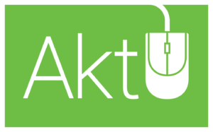

Idag är det aktivitetsutskottets tur att presentera sig! Om du känner dig sugen på att ansöka till ett utskott finns mer information, ansökan och kontaktpersoner på [d-sektionen.se/ansok](https://d-sektionen.se/ansok/).  <!--more-->

## Vad gör aktivitetsutskottet?

Det kan vara den svåraste frågan att svara på. Som namnet antyder fixar vi aktiviteter för sektionens medlemmar. Vad dom aktiviteterna är, är helt upp till oss. Vi har några standardaktiviteter, brädspel(måndag), innebandy(tisdag) & fotboll(söndag), som vi kör på rutin sen är alla idéer välkomna.

## Varför ska man söka till aktivitetsutskottet?

För att vi är det mest fria utskottet. Om man har en hobby som man tror att resten av sektionen vill vara med på så är det bara att gå med och hjälpa till att fixa och dona. Dessutom är det ju vi som gör flest aktiviteter per år.

## Vilka egenskaper är bra för att vara med i aktivitetsutskottet?

Människor som är bra på att tagga till är bra. För om vi själva i AktU är taggade så kommer det spridas till resten av sektionen. Andra bra egenskaper är lugn i stressade situationer. När ett event är igång vill man ju aldrig avbryta det då behövs det att man kan slappna av när det behövs. Idéer är något vi aldrig kan få nog av så är man en idéspruta är det ett plus för utskottet. Inga idéer är för dåliga.

## Hur mycket arbete innebär det att vara med i aktivitetsutskottet?

Det beror helt och hållet på vad vi som grupp bestämmer. Vi har en del riktningar att gå mot men det är nästan aldrig något krav på att vi ska göra något. Det som är tydligt att vi ska göra är att fixa mittensitsen och typ CSN (eventuellt en resa också) och eftersom det är lite större events så kommer det behövas att alla hjälper till.
