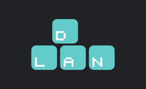

Lagom till dagens [inspirationsföreläsning och rekryteringspub](https://www.facebook.com/events/240172143336395/) kommer den sista presentationen. Den här gången handlar det om D-LANs projektgrupp! Om du känner dig sugen på att ansöka till ett utskott finns mer information, ansökan och kontaktpersoner på [d-sektionen.se/ansok](https://d-sektionen.se/ansok/).

 <!--more-->

## Vad gör D-LANs projektgrupp?

Anordnar LiUs största LAN, D-LAN! Varje år planerar en ny projektgrupp årets största LAN-händelse för alla LiUs studenter. Lägga scheman, ordna sponsorer, designa posters, planera event, konfigurera nätverk, skapa turneringar, boka lokaler, sätta upp hemsida, marknadsföra! Det är mycket som ska fixas med innan eventet går av stapeln. Självklart hinner man hitta på massa annat tok och kul där emellan också!

## Varför ska man söka just till D-LANs projektgrupp?

För att få vara med och forma D-LAN 2019, så att det kan bli ett så bra event som möjligt. För att du gillar LAN. För att du tycker det är kul att ha kul. För att du gillar att vara en del av maskineriet som driver ett stort event. För att bli sektionsaktiv. Det finns massa anledningar! Eftersom D-LAN är en projektgrupp och inte ett utskott blir ditt arbete även mera målinriktat och resultatorienterat! Att få jobba mot ett mål av den här storleken som sedan förverkligas är en fantastisk upplevelse!

## Vilka egenskaper är bra för en person i D-LANs projektgrupp?

Att du är en glad och trevlig människa som gillar att diskutera och bolla idéer. Det är självklart även ett plus om du har erfarenhet av ditt specifika ansvarsområde, alternativt är taggad på att lära dig massor under projektets gång! Att kunna känna stolthet i att göra ett jobb som tar D-LAN 2019 till nästa nivå är också en viktig egenskap, att vilja ge det där lilla extra!

## Hur mycket arbete innebär det att vara med i D-LANs projektgrupp?

Under ungefär 5 månader planeras och förbereds inför eventet. Desto närmre LANet vi kommer desto intensivare blir arbetet, men desto roligare blir det också! Du kommer se till att just ditt ansvarsområden blir ordnat och uppstyrt samt tillsammans med dina projektvänner planera hela eventet. Detta betyder ungefär ett möte med projektgruppen i veckan samt någon kväll här och där för att fixa med ditt eget ansvarsområde.
