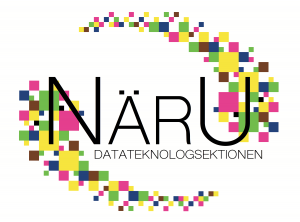

Dagens utskottspresentation kommer från näringslivsutskottet! Om du känner dig sugen på att ansöka till ett utskott finns mer information, ansökan och kontaktpersoner på [d-sektionen.se/ansok](https://d-sektionen.se/ansok/).

 <!--more-->

## Vad gör näringslivsutskottet?

Näringslivsutskottet arbetar med att bygga relationer med företag och organisationer som kan hjälpa sektionens medlemmar ut i arbetslivet. Vi arrangerar lunchföreläsningar, casekvällar, bussresor, och annat spännande i samarbete med företag.

## Varför ska man söka till näringslivsutskottet?

Gillar man att knyta kontakter, och tycker att det skulle vara spännande med att sköta relationen mellan företag och D-sektionen så är NärU helt klart det bästa man kan söka. Här kan man prova sina idéer, utveckla affärsmannaskap och vara med att genomföra många spännande events!

## Vilka egenskaper är bra för att vara med i näringslivsutskottet?

Man ska vara lite orädd, samt nyfiken på företag som vill samarbeta med oss. Man ska även vara taggad på att hjälpa till att dela ut mat innan föreläsningar, och bära läskbackar från Baljan. Framförallt ska man vara villig att utvecklas och ha kul!

## Hur mycket arbete innebär det att vara med i näringslivsutskottet?

Man bestämmer rätt mycket själv, men målet är att alla medlemmar i utskottet ska hantera två-tre företag som man är med och gör några få events med per år. Vi gör mycket tillsammans, och framförallt så hjälps vi åt att arrangera våra evenemang. Någon enstaka timme i veckan, vilket inkluderar lunchmöte, kommer man långt på när alla hjälps åt!
