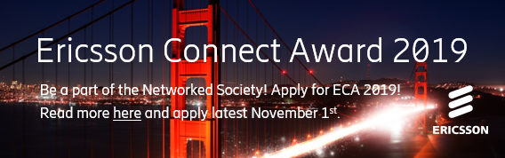

<!--more-->

As a part of Ericsson’s cooperation with Linköping University, we are pleased to announce the Ericsson Connect Award 2019. The students who win the award will have an excellent opportunity to get an insight into the exciting worlds of ICT, IoT and telecom, and how Ericsson drives and contributes towards our vision of an all communicating world.

The award will be given to two students. The winners will get a personal mentor at Ericsson for 1 year, and will get a chance to follow the mentor to one of Ericsson’s sites for a study visit. They will also visit Ericsson’s demo center in Stockholm for interesting activities and meetings, and they will be given the opportunity to get a summer internship and/or to perform master thesis at Ericsson Linköping.

The winners will be announced during the LINK banquet 2018-11-29.

Criteria to apply:

- Has completed 3rd year at one of the following master's programs at Linköping University: D, IT, Y, U, IIT, MT, ED, KTSDT
- Is enrolled at Linköping University for the 2018-19 academic year
- Shows a genuine interest in technology
- Is a team player with communicative and social skills

Apply with a personal letter, CV, academic record, and any document that verifies the criteria to:

Svante Stadler email: svante.stadler@ericsson.com

Deadline to apply: 2018-11-01.

Find the Facebook event at: [https://www.facebook.com/events/565409110558811/](https://www.facebook.com/events/565409110558811/)
