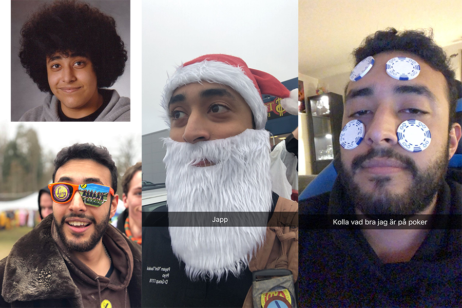

Nu har alla Donnaintervjuer publicerats och vi går över till D-Group. Först ut är Payam Tavakoli, årets D-Group Chief.

Tycker du posten D-Group Chief låter intressant? Gå in på [facebook.com/events/351527158730136/](https://www.facebook.com/events/351527158730136/) eller [d-sektionen.se/sok-fortroendeposter](https://d-sektionen.se/sok-fortroendeposter) för mer information om hur du kan söka posten för nästa läsår.

Ansökan stänger 9 januari.

## Vem är du?

Mitt namn är Payam Tavakoli, 23 år, från Stockholm, Sollentuna, läser andra året på Datateknik. Gillar att gamea när tiden tillåter, bygga datorer, memea loss, arrangera event samt delta i sådana. Mig hittar du ofta i sektionsrummet Netlight, frustrerad över att min kod inte funkar, eller i en bar på kårallen, brukar vara på bägge sidorna av dom bardiskarna rätt ofta. <!--more-->

## Kan du berätta om din post?

Chiefsposten är allt annat än lättdefinerad. Du är ansvarig för att se till att D-Groups arbete går framåt och att det görs på ett sunt sätt. Att D-Group som organisation utvecklas, förbättras, att medlemmarna mår bra och stämningen i gruppen är god. Du är även ansvarig för att representera D-Group i möten med andra festerier, kårhus, studentkårer och liknande.

## Vad tycker du är viktiga egenskaper om man vill söka din post?

Egenskaper jag gärna ser i en Chief är driv, empati, tålamod och framförallt förmågan att förstå när man har fel och kunna be om ursäkt. Det är viktigt att man kan ändra på sina åsikter och kunna kompromissa.

## Vad har varit roligast under ditt år?

Det som har varit roligast under mitt år har vart att man får träffa så många drivna och talangfulla människor som helt enkelt är ett nöje att umgås och arbeta med! En annan grej är att jag som person har utvecklats väldigt mycket och lärt mig mycket som jag tror gör mig till en bättre människa än jag var innan jag tog mig an posten.

## Varför ska man söka din post?

Man ska söka Chief för att det är en otroligt bra chans att utvecklas som person samtidigt som man får åka på en otrolig resa som slutar med en bunt sjuka, förjävliga, men framförallt roliga minnen. Men bättre än det, ett gäng med 12 otroligt bra vänner.

## Hur mycket tid har du lagt ned i snitt per vecka?

Det är väldigt svårt att säga, kan slänga ut ungefär 10-15h i veckan som något sorts snitt. Men de sociala delarna av att vara med i D-Group brukar ta upp mycket mer tid än så.
