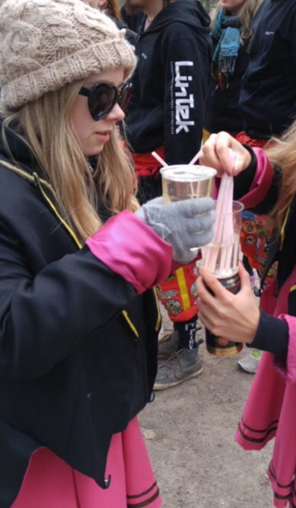

Nästa intervju är med Hanna Kvist, sektionens ordförande.

Tycker du att posten sektionsordförande låter intressant? Gå in på [facebook.com/events/351527158730136/](https://www.facebook.com/events/351527158730136/) eller [d-sektionen.se/sok-fortroendeposter](https://d-sektionen.se/sok-fortroendeposter) för mer information om hur du kan söka posten för nästa läsår.

Ansökan stänger 9 januari.

## Vem är du?

Hanna heter jag och är 24 år och kommer från östgötaschlätten. Har studerat på denna sektion i vad som nästan räknas som en evighet (går IT6) och har hunnit engagera mig lite grann under min tid. Har varit med i marknadsföringsutskottet, Donna, LINK och sitter just nu på posten som sektionsordförande (eller supreme leader/mamma som är synonym för min post). Går du IT så kanske du har sett mig som basgruppshandledare då jag även hunnit med det ett par gånger.

<!--more-->

## Kan du berätta om din post?

Min post som ordförande är väldigt blandad i vad man får göra - då den kan skilja sig endel från vecka till vecka. Det som man såklart får göra är att hålla i och planera styrelsemöten och sektionsmöten, samt leda styret till att arbeta för och förbättra den redan bästa sektionen. Sen får man gå på en hel del andra spännande möten, både inom och utanför sektionen.

## Vad tycker du är viktiga egenskaper om man vill söka din post?

Är man strukturerad, gillar att planera, ha ansvar och är duktig på och gillar att kommunicera så har man alla grunder till att kunna klara av denna post galant! Att tycka om och värna om sektionen och dess framtid är också väldigt viktigt.

## Vad har varit roligast under ditt år?

Mycket har varit roligt under denna tid jag suttit på posten, att få tackla och lösa problem och utmaningar tillsammans med styret har varit både lärorikt och kul. Och att få lära känna massa nytt folk. Även att få utmana sig själv och testa på saker man inte gjort förut.

## Varför ska man söka din post?

Posten är väldigt lärorik och man får göra olika saker från vecka till vecka, man får lära känna massa trevliga människor och träna på att bli en bättre ledare. I vissa aspekter är posten väldigt fri och man kan lägga ner tid på just det man själv tycker är viktigt.

## Hur mycket tid har du lagt ned i snitt per vecka?

Kan vara väldigt olika från vecka till vecka, men ca 5-10 timmar i snitt skulle jag säga.
