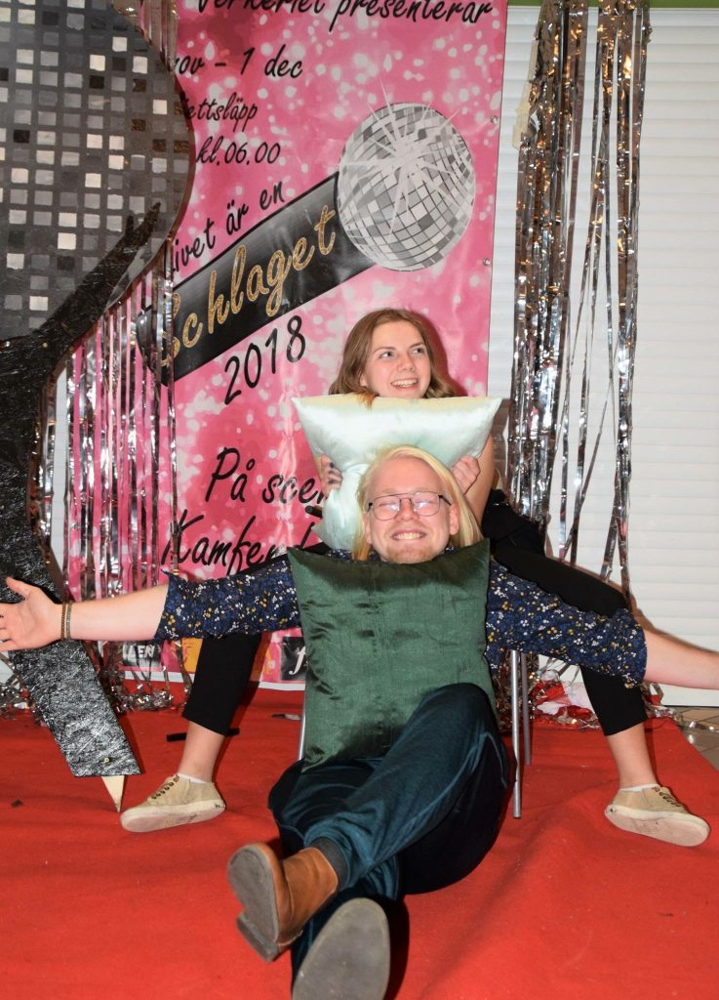

I början av februari är det dags för läsårets andra sektionsmöte, vintermötet. Där kommer många spännande poster för verksamhetsåret 19/20 tillsättas och för att ge en bättre bild av vad posterna innebär har de som sitter på posterna i år besvarat några frågor.

Först ut är ingen mindre än årets ordförande för Donna, Elise Lång!

Tycker du posten PrimaDonna låter intressant? Gå in på [facebook.com/events/351527158730136/](https://www.facebook.com/events/351527158730136/) eller [d-sektionen.se/sok-fortroendeposter](https://d-sektionen.se/sok-fortroendeposter) för mer information om hur du kan söka posten för nästa läsår.

Ansökan stänger 9 januari.

## Vem är du?

Jag heter Elise och är en nedflyttad norrlänning som i nuläget läser tredje året på datateknik. Tycker de är kul med att lära mig nya saker, förra året lärde ja mig de roliga med bokföring och iår hur man hittar kuddar på Kårallen..

<!--more-->

## Kan du berätta om din post?

Som PrimaDonna är det mitt ansvar att saker, som vi både måste göra och vill göra, i huvudsak blir gjorda. Det är en blandning av framåttänk med hur saker fungerar i nuläget så som hur alla mår och hur allt går just nu. Jag är även ansiktet utåt på exempelvis sektionsmöten och kanslimöten.

## Vad tycker du är viktiga egenskaper om man vill söka din post?

Det viktigaste som ordförande är att vara strukturerad, det hjälper mycket för att gruppen ska kunna gå från idé till handling. Något som är viktigt för mig personligen är att vara öppen för förändring och att inte vara rädd att ta tag i saker, sen är det alltid nice att vara allmänt taggad!!

## Vad har varit roligast under ditt år?

Ojj... Förrutom att ha ett så mysigt donnastyre måste det vara antingen Nolle-fikat med alla nya studenter som var extra många iår!! (wow!!) Eller Winter Wonderland vi hade i november för både tjejer, ickebinära och killar. Det var hur mysigt och kul som helst!

## Varför ska man söka din post?

Jag tycker att man ska söka PrimaDonna om man vill hantera och utveckla donnastyrets helhet, som kan vara ifrån våra stassar till kräftis, tillsammans med ett underbart gäng!

## Hur mycket tid har du lagt ned i snitt per vecka?

Det har nog varit kring 4 timmar i veckan. Nu när stilett börjar, då jag är projektledare, blir det mer.
