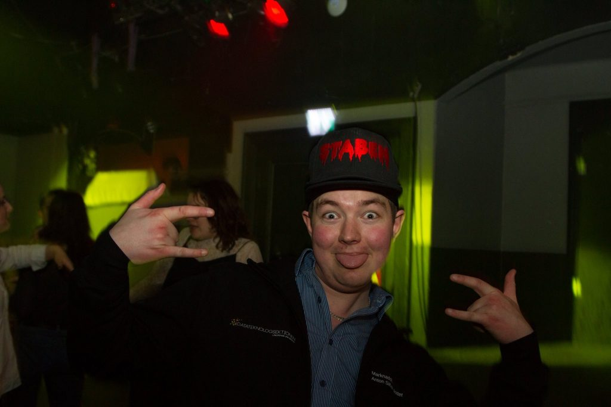

Nästa intervju är med Anton Silfver, sektionens vice ordförande.

Tycker du att posten vice ordförande låter intressant? Gå in på [facebook.com/events/351527158730136/](https://www.facebook.com/events/351527158730136/) eller [d-sektionen.se/sok-fortroendeposter](https://d-sektionen.se/sok-fortroendeposter) för mer information om hur du kan söka posten för nästa läsår.

Ansökan stänger 9 januari.

## Vem är du?

Ni vet vem jag är.

<!--more-->

## Kan du berätta om din post?

Främst som vice så understöttar du ordförande och gör vad hon säger, men det finns även andra roliga uppdrag. Du får jobba med att samordna alla utskottsarbeten och se till att de kan genomföra sin verksamhet. Du sitter som ordförande i kansliet där alla förtroendevalda inom sektionen samlas. Du hjälper ordförande med att representera sektionen mot LinTek och andra sektioner och du är välkommen på en rad olika möten. Du får också jobba med att alla sektionsaktiva ska ha det bra genom att t.ex. ansvara för sektionsaktivas.

## Vad tycker du är viktiga egenskaper om man vill söka din post?

Jag tycker det är viktigt att du är en lugn och ansvarstagande person med ett starkt driv. Du ska tycka det är viktigt att sektionens verksamheter fungerar bra och samarbetar. Du är duktig på att lyssna men också att stå för din åsikt. Slutligen tycker jag det är viktigt att du kan sätta egna intressen åt sidan för sektionens bästa.

## Vad har varit roligast under ditt år?

Det är svårt att säga vad som har varit roligast under mitt år och jag är ju inte ens klar än :) Men utöver att få lära känna alla mysiga i styret så är det nog att få en så stor inblick i hur allting fungerar i sektionen och att i många fall kunna hjälpa till att lösa problem!

## Varför ska man söka din post?

Jag tycker du ska söka posten som vice ordförande om du vill jobba nära alla våra utskott och ha koll på vad som händer inom sektionen. Du har idéer om vad som skulle kunna fungera bättre och vill vara med att ta beslut som påverkar sektionen i stort. Du vill skaffa dig en värdefull erfarenhet och träffa många drivna personer inom och utanför sektionen.

## Hur mycket tid har du lagt ned i snitt per vecka?

Jag lade ner väldigt mycket tid på mitt uppdrag i början och runt vissa event. Under lugnare perioder försöker jag lägga ungefär 5 timmar i veckan på uppdraget.
