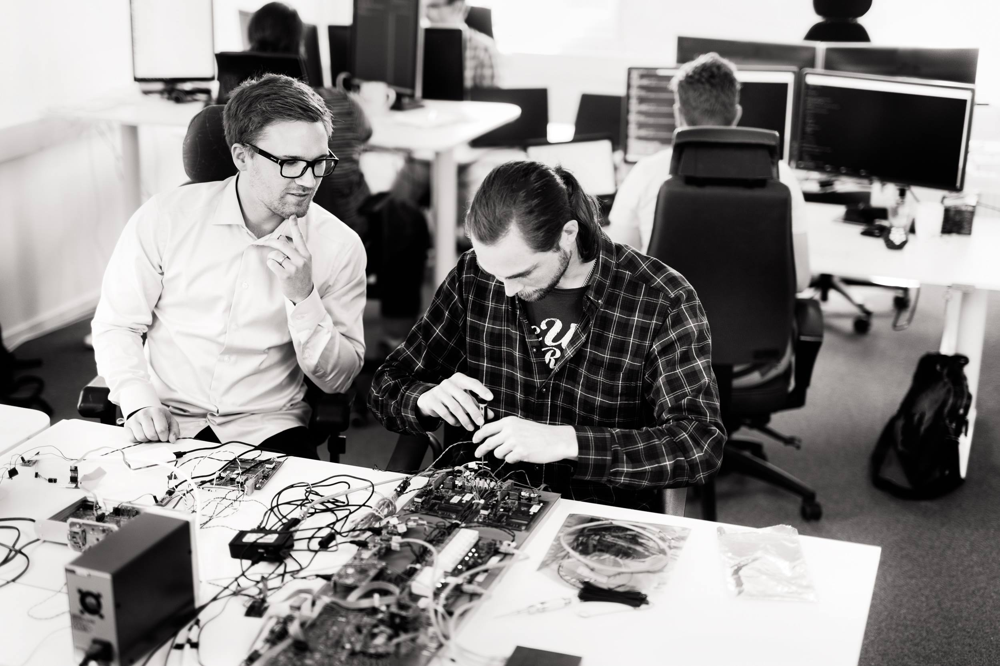

### 

### Välkomna på företagskväll hos Attentec!

Är du nyfiken på arbetslivet? Hur är det att vara ny som utvecklare? Kom och lyssna när våra konsulter, Mikael och Rasmus, pratar om saker de önskar de visste när de var nya. Det kommer handla både om mindset och vad som kan vara bra att tänka på, så väl som praktiska tips.<!--more-->

Kvällen övergår sedan till en workshop i hur man använder en debugger. En väldigt nyttig färdighet som många önskar de behärskade. Efter en gemensam genomgång får ni prova själva att tillämpa det ni lärt er. Det sker under formen mobb-programmering, vilket är som parprogrammering, fast med fler, och är roligare!

Under kvällen bjuds det även på mat och dryck.

Tid: 7/3 kl. 17:30-20:30 Plats: Attentec, Teknikringen 4b, 583 30 Linköping

Anmälan: [https://goo.gl/forms/NZdNb8CpI3oSResm1](https://goo.gl/forms/NZdNb8CpI3oSResm1)

Evenemanget på Facebook: [https://www.facebook.com/events/578734222601313/](https://www.facebook.com/events/578734222601313/)
