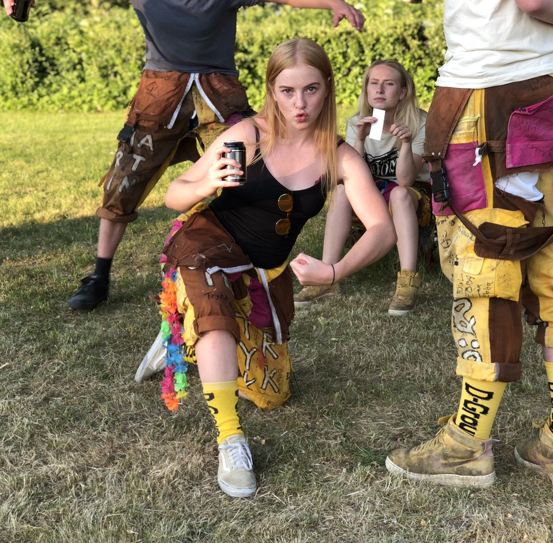

Nästa intervju är med sektionens Art Director.

Tycker du att posten låter intressant? Gå in på [facebook.com/events/256581041936923](https://www.facebook.com/events/256581041936923/) eller [d-sektionen.se/sok-fortroendeposter](https://d-sektionen.se/sok-fortroendeposter) för mer information om hur du kan söka posten för nästa läsår.

Ansökan stänger 31 mars.

## Vem är du?

Sofie Liljedahl, pluggar D3

<!--more-->

## Kan du berätta om din post?

Sektionens Art Director är ansvarig för loggor och grafisk profil, man ser även till att sektionens trycksaker har ett enhetligt utseende. Man finns även som en resurs för utskott som behöver hjälp med tryck.

## Vad tycker du är viktiga egenskaper om man vill söka din post?

Strukturerad, kreativ och intresse för grafisk design.

## Vad har varit roligast under ditt år?

Att få trycka lökar samt äta lökar.

## Varför ska man söka din post?

Man får chansen att trycka och man får en mer övergripande inblick i sektionen och dem olika utskotten. Det är även superkul att vara sektionsaktiv!

## Hur mycket tid har du lagt ned i snitt per vecka?

Ca 1-2 timmar i veckan

## Vad är ditt bästa minne av Payam under året?

När Payam födde barn
