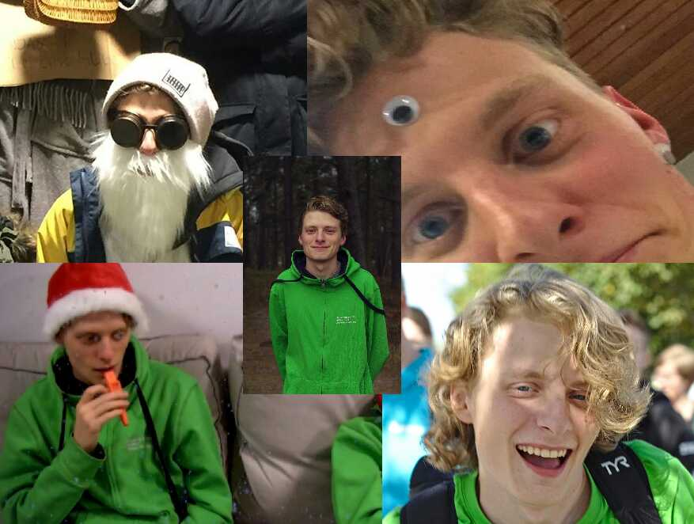

Ansökningsperioden för förtroendeposter till vårmötet är i full gång och för att ge alla en bättre inblick i vad posterna innebär kommer vi publicera intervjuer med de som har posterna nu. Först ut är aktivitetsutskottets ordförande, även kallad aktivitetshanterare.

Tycker du att posten låter intressant? Gå in på [facebook.com/events/256581041936923](https://www.facebook.com/events/256581041936923/) eller [d-sektionen.se/sok-fortroendeposter](https://d-sektionen.se/sok-fortroendeposter) för mer information om hur du kan söka posten för nästa läsår.

Ansökan stänger 31 mars.

## Vem är du?

Jag heter Fabian, är 21 år, originellt från Linkan, går U3 och är Datateknologsektionens Aktivitetshanterare i år. Detta är mitt första år som sektionsaktiv och förutom att hålla på med AktU-stuff gillar jag spex, att simträna, prova öl, glömma att vattna min kaktus, och träffa folk.

<!--more-->

## Kan du berätta om din post?

Min post är att vara ordförande för en av sektionens största utskott, Aktivitietsutskottet. Inom aktivitetsutskottet ingår nämligen mer än de i gröna tröjor även D-LAN och D-Band hör till Aktivitetsutskottet. Detta innebär att som aktivitetshanterare är man delaktig i flest aktiviteter på sektionen. Med allt från sport till halvtidssittning och retrospelkvällar.

## Vad tycker du är viktiga egenskaper om man vill söka din post?

Det viktigaste tror jag är att ha tillit till människor. Utskottet gör alldeles för mycket för att man ska ha tid att oroa sig över minsta detalj, därför måste man kunna lita på att saker blir gjorda utan att man hänger över deras axel. Man borde även gilla att prata med folk då man är ansvarig för mellan 20 och 30 personer så krävs det att man inte är rädd för att ta kontakt med dem när det behövs. Särskilt viktigt är det att man är villig att ge kritik på andras idéer för idéerna ska bli bra.

## Vad har varit roligast under ditt år?

Först och främst tror jag inte det roligaste har hänt än. Åtminstone 3 top notch saker jag ska göra under våren. Jag tror dock Ettans Tackfest kan vara det roligaste hittils. Jag hade tittat på eventet med förstoringsglas sen innan Ettan sa att dom ville göra det. Sen var jag på festen som deltagare och hade sjukt kul. Jag tror dock att Ettan inte håller med om att jag var rolig.

## Varför ska man söka din post?

Man får lära känna jättemånga fantastiska människor som brinner för vad de gör. Jag har lärt känna studenter jag aldrig annars hade kunnat allt från sektionens styre, till 1:an som vill hålla en kul tackfest, till Y-AktU som vill glida runt med sina D motparter, osv.

## Hur mycket tid har du lagt ned i snitt per vecka?

Mina arbetstimmar har varit oerhört varierat men jag skulle säga att det ligger mellan 4 och 8 timmar i veckan.

## Vad är ditt bästa minne av Payam under året?

Specialfaddertack, jag tror vårt bord på ca 10 personer var mer högljutt än resten av rummet, det kanske var av det skälet till att vårt bord stod så långt borta ifrån alla andra bord...
