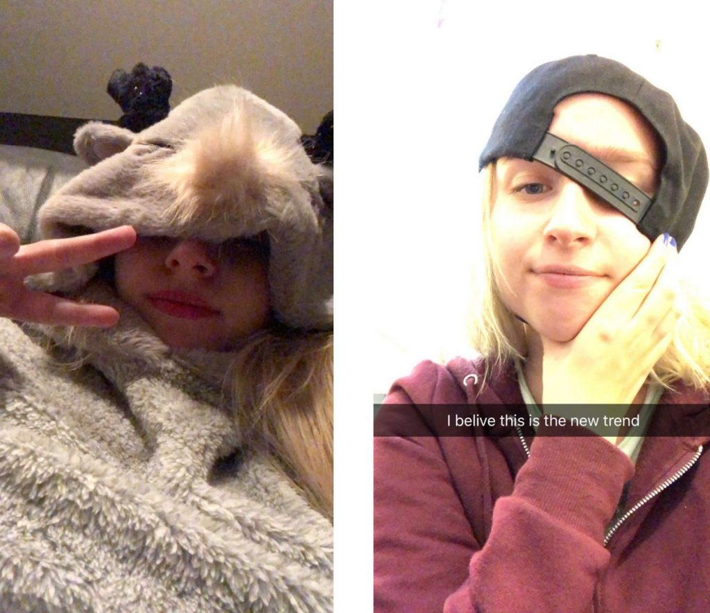

Nästa intervju är med alumniutskottets ordförande.

Tycker du att posten låter intressant? Gå in på [facebook.com/events/256581041936923](https://www.facebook.com/events/256581041936923/) eller [d-sektionen.se/sok-fortroendeposter](https://d-sektionen.se/sok-fortroendeposter) för mer information om hur du kan söka posten för nästa läsår.

Ansökan stänger 31 mars.

## Vem är du?

Jag heter Moa Dahlqvist och är en tjej på 21 år. Jag kommer från Mantorp och pluggar tredje året på D-programmet. Jag har alltid varit intresserad av spel och därför hamna jag här på Liu. På fritiden kör jag trav, spelar spel, går ut och går med mina två hundarna, umgås med vänner och försöker övertala mig själv att börja springa igen.

<!--more-->

## Kan du berätta om din post?

Som ordförande för alumniutskottet har du ansvar för att kontakta alumner och anordna evenemang för dem och studenterna tillsammans med ditt utskott. Som ordförande är du även med i sektionens kansli och ett alumniråd där alla alumniordförande på LiTH sitter. Du kan alltså påverka sektionen och alumniverksamheten hos alla program på LiTH.

## Vad tycker du är viktiga egenskaper om man vill söka din post?

Den viktigaste egenskaperna är nog att du kan ta initiativ och inte är rädd att kontakta andra. Alumni är en av de mindre utskotten och det finns mycket utrymme för nya aktiviteter ifall du har engagemanget.

## Vad har varit roligast under ditt år?

Det roligaste har varit att lära känna, och jobba, med nya människor. Alumni kom också med nya utmaningar såsom GDPR vilket var intressanta att lösa.

## Varför ska man söka din post?

Alumni är perfekt ifall du vill prata med alumner och se hur arbetslivet hos dem ser ut. Det finns mycket rum för nya idéer och du kan sätta din egen prägel på utskottet.

## Hur mycket tid har du lagt ned i snitt per vecka?

På en vecka lägger jag i genomsnitt ner tre timmar på alumniarbete.

## Vad är ditt bästa minne av Payam under året?

Under sektionens kick-off så fick jag chokladpudding av Payam <3
