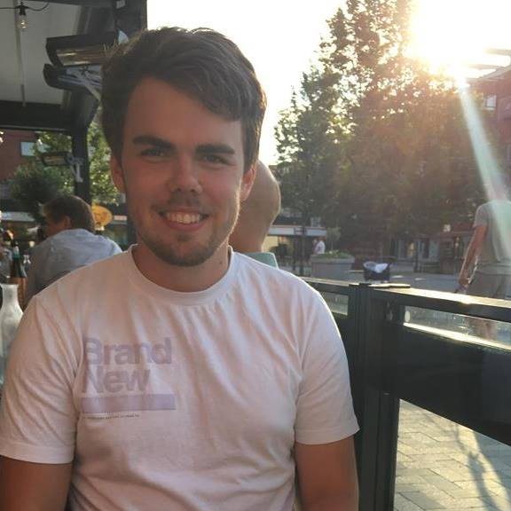

Nästa intervju är med vår D-snordf.

Tycker du att posten låter intressant? Gå in på [facebook.com/events/256581041936923](https://www.facebook.com/events/256581041936923/) eller [d-sektionen.se/sok-fortroendeposter](https://d-sektionen.se/sok-fortroendeposter) för mer information om hur du kan söka posten för nästa läsår.

Ansökan stänger 31 mars.

## Vem är du?

Hej! Jag heter Robert, läser datateknik andra året. Jag älskar MAI! Ville bara säga det, och jag menar det ? Annars gillar jag att progga och sånt där nördigt som vi D-are gör, ni vet.

<!--more-->

## Kan du berätta om din post?

Som Studienämndsordförande för datateknik sitter man som namnet skvallrar om, som ordförande för en studienämnd. Det är egentligen den grupp där alla klassrepresentanter är med, mitt uppdrag är då att leda dem och se till att kursutvärderingar görs, examinatorsmöten hålls och att allt underlag skickas till LinTek när det är klart.

Dessutom sitter man med i både programplanegruppen och programnämnden, vilka är de som bestämmer mer eller mindre allt om våra utbildningar. Till exempel tas där beslut om kurser ska flyttas, bytas ut eller om andra åtgärder krävs på programmet. I nämnden är alla institutioner relevanta för oss representerade, vilket gör det väldigt enkelt att påverka!

Sammanfattningsvis handlar rollen om att kvalitetssäkra utbildningen, vilket är viktigt!

## Vad tycker du är viktiga egenskaper om man vill söka din post?

Jag tror det är viktigt att tycka om att jobba med förbättringar. Det handlar mycket om att ta in åsikter från många håll och kanter, kunna sammanställa dem till någonting konkret och rimligt och sedan framföra detta till berörda parter. Framförallt är det nog viktigt att vilja lära sig någonting nytt, du kommer att få lära känna universitets urverk från insidan på ett helt annat sätt.

## Vad har varit roligast under ditt år?

Att bli nominerad till PrimaDonna ?

Jag har egentligen två grejer, först hade vi ett nämndinternat, då åkte vi till ett fint hotell i Söderköping och hade nämndmöte där. Allting var betalt från nämnden. Vi diskuterade med MAI hur man kunde öka genomströmning och sånt. Ett andra nämndmöte var på SAAB, då fick vi också en guidad tur, kollade på undervattensrobotar och liknande. Riktigt spännande!

## Varför ska man söka din post?

Man får lära sig sjukt mycket om sektionen, universitetet och LinTek. Dessutom får man leda en grupp studenter, och arbeta för att våra utbildningar ska bli bättre, vilket gynnar oss alla! Det krävs inte heller några förkunskaper alls!

## Hur mycket tid har du lagt ned i snitt per vecka?

Ärligt talat är det här en av de mindre krävande posterna när det gäller tid. Vissa perioder är mer intensiva, men långt ifrån orimliga. Jag skulle gissa att jag snittar ca 1h per vecka.

## Vad är ditt bästa minne av Payam under året?

Han skiner som en sooooool :))))
