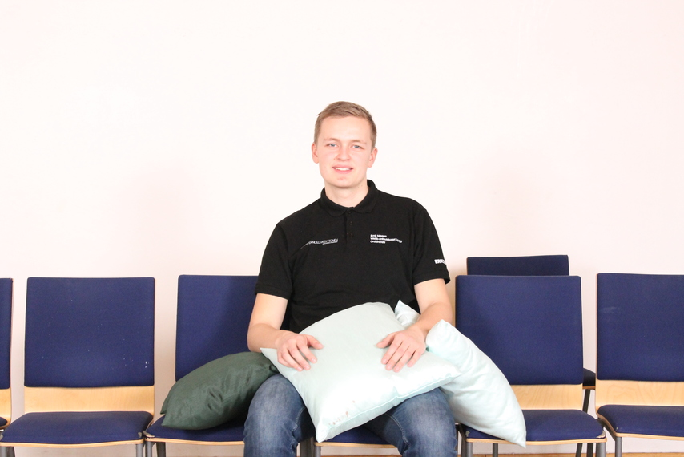

Nästa intervju är med sektionens infochef, ordförande för webb-/infoutskottet.

Tycker du att posten låter intressant? Gå in på [facebook.com/events/256581041936923](https://www.facebook.com/events/256581041936923/) eller [d-sektionen.se/sok-fortroendeposter](https://d-sektionen.se/sok-fortroendeposter) för mer information om hur du kan söka posten för nästa läsår.

Ansökan stänger 31 mars.

## Vem är du?

Hi again! Mitt namn är Emil, jag pluggar U2 och är sektionens infochef.

<!--more-->

## Kan du berätta om din post?

Posten handlar kortfattat om att tillsammans med sitt utskott sköta sektionens informationsspridning, det inkluderar bland annat att hantera sektionens sociala medier, publicera innehåll på sektionshemsidan, skicka infomail och ansvara för fotograferingen.

Inför kommande verksamhetsår min post genomgått många förändringar. Detta öppnar upp möjligheter att driva nya projekt utefter egna idéer. Ett exempel är att satsa mer på tryck.

Den nya posten heter webb-/infochef och innebär att man är ordförande i webb-/infoutskottet. I praktiken är man dock endast verksam i infodelen av utskottet enligt en [proposition på vintermötet](https://d-sektionen.se/wp-content/uploads/2019/01/Proposition-ang%C3%A5ende-splittring-av-webb-2Finfoutskottet.pdf).

Posten har även splittrats från sekreterare vilket gör att man som webb-/infochef inte är styrelseledamot.

Om du har några övriga funderingar om vad posten innebär eller kommer innebära får du gärna maila info@d-sektionen.se.

## Vad tycker du är viktiga egenskaper om man vill söka din post?

Jag tycker det är bra om man är kreativ så att man kan komma på nya och bra sätt att nå ut till folk samt göra informationen man skickar ut lockande. Man ska inte heller vara rädd för att filtrera vilken information som är viktig för sektionens medlemmar och bör spridas. Utöver det är det viktigt att vara organiserad.

## Vad har varit roligast under ditt år?

Det har varit kul att lära känna alla utskottsmedlemmar, bland annat på vår kickoff som var på Villevalla pub. Jag tycker också det har varit väldigt kul att vara en del av årets kansli.

## Varför ska man söka din post?

Man blir ledare för ett utskott och på så vis utvecklar man sina ledaregenskaper. Man lär känna många nya människor i hela sektionen. Man får en post som i grunden är rätt så simpel, men har stor potential för att driva egna idéer.

## Hur mycket tid har du lagt ned i snitt per vecka?

Det är väldigt svårt för mig att säga i och med de stora förändringarna i posten. Men det minsta man kan förvänta sig är att man behöver svara på en del mail, hantera kanalerna och leda utskottet. Mycket av det sker efter behov när man råkar få en notis.

Med det sagt skulle jag gissa på att 2-3 timmar i veckan krävs för att hålla sig flytande en vanlig vecka. Utöver det hoppas jag att man är villig att lägga ner lite extra tid för att utveckla utskottets arbete, nu när det finns mycket mer tid över till det.

## Vad är ditt bästa minne av Payam under året?

När han lärde sig göra egna emojis i Slack.
