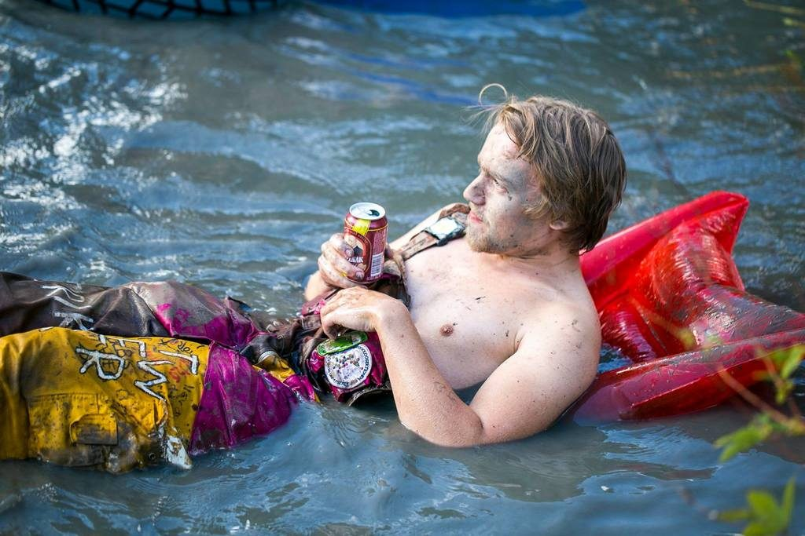

Det börjar närma sig deadline för ansökningar och därmed är det dags att presentera sista intervjun för den här gången; Intendenten, ordförande för werkmästeriet.

Tycker du att posten låter intressant? Gå in på [facebook.com/events/256581041936923](https://www.facebook.com/events/256581041936923/) eller [d-sektionen.se/sok-fortroendeposter](https://d-sektionen.se/sok-fortroendeposter) för mer information om hur du kan söka posten för nästa läsår.

Ansökan stänger 31 mars.

## Vem är du?

Tjenare! Erik heter jag och jag pluggar tredje året på IP. Jag gillar att fylla min fritid med att engagera mig i diverse saker, kasta pil och hänga med Lingare.

<!--more-->

## Kan du berätta om din post?

Intendenten har ansvar över sektionens alla materiella ting och utrymmen. Exempel på detta är att se till att sektionens egna bil DARTen (förkortning för Datateknologsektionens Awesome Räcerbil för Transport) fungerar och att se till att sektionsrummen hålls städade. Till sin hjälp med detta har man sitt egna utskott Werkmästeriet, där man sitter som ordförande.

## Vad tycker du är viktiga egenskaper om man vill söka din post?

Att man gillar att ställa upp och hjälpa utskott och personer även om det inte syns utåt. Även att man har snabba lösningar på problem som man kommer få.

## Vad har varit roligast under ditt år?

Att få lära känna så många som är sektionsaktiva och att sitta och diskutera fram lösningar på diverse problem. Dock har det allra bästa såklart varit att bära.

## Varför ska man söka din post?

För att få lite omväxling i vardagen från datorskärmen och istället få arbeta praktiskt. Man får även bra erfarenheter från både att vara ordförande och att sitta med i kansliet.

## Hur mycket tid har du lagt ned i snitt per vecka?

Då det för mig även ingått att sitta med i styret är det inte jätteenkelt att särskilja vissa gånger vad som har varit som styrelsemedlem och vad har varit som ordförande i Werkmästeriet.

Min uppskattning är att jag lagt ca 3h i veckan, något jag hade velat haft högre men inte kunnat. Förhoppningsvis kommer nästa intendent kunna lägga ner mer tid än så eftersom utskottet har utvecklingsmöjligheter.

## Vad är ditt bästa minne av Payam under året?

När han lånade min rakapparat en eftermiddag för att raka av sig håret. När han kom halvvägs så tog batteriet slut, och vi hade ingen möjlighet att hämta laddaren. Så han fick springa runt en hel dag med 50 % av huvudet rakat.
