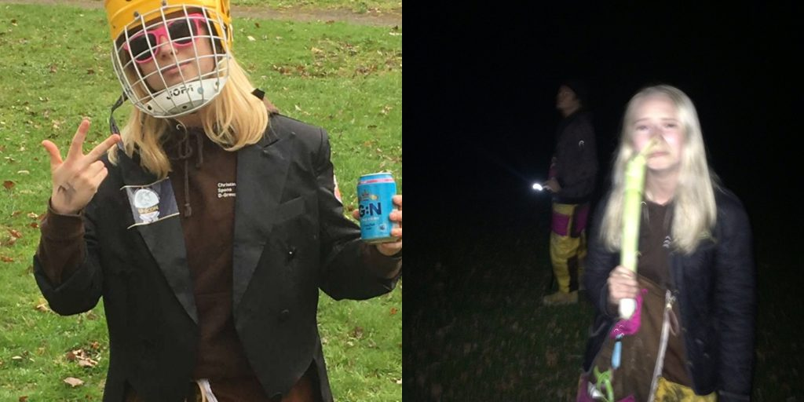

Idag är det D-Pub och vad passar då bättre än en intervju med pubutskottets ordförande?

Tycker du att posten låter intressant? Gå in på [facebook.com/events/256581041936923](https://www.facebook.com/events/256581041936923/) eller [d-sektionen.se/sok-fortroendeposter](https://d-sektionen.se/sok-fortroendeposter) för mer information om hur du kan söka posten för nästa läsår.

Ansökan stänger 31 mars.

## Vem är du?

Jag heter Christina är 21 år och pluggar tredje året på datalinjen. Tycker allt som har med det kulinariska att göra är superkul, favoriträtten är svamprisotto.

<!--more-->

## Kan du berätta om din post?

Min post som ordförande går ut på att ha övergripande koll på läget och se till så allt flyter på som det ska. Det kan handla om att delegera ansvarsområden, driva rekrytering eller sköta kommunikation internt i sektionen och externt med andra föreningar på Liu.

## Vad tycker du är viktiga egenskaper om man vill söka din post?

Jag tror att en av de viktigaste egenskaperna man behöver för att vara ordförande för PubUtskottet är ledarskap. Eftersom gruppen är så pass självgående och etablerad behövs en ordförande som kan anpassa sig efter gruppdynamiken och kunna känna av vilken roll som behöver fyllas för stunden.

## Vad har varit roligast under ditt år?

Att hänga med världens bästa gäng! En pubdag är verkligen superkul och jag brukar tänka att om en företagsgrupp skulle testa arrangera en pub skulle det vara bästa team-buildingsaktiviteten de någonsin gjort. (släng er i väggen Escape-room)

## Varför ska man söka din post?

Toppentillfälle att utveckla ledarskapsförmågor och testa hur det känns att ansvara för en verksamhet. Man lär sig snabbt att hantera kniviga situationer och blir bra på att strukturera upp arbete.

## Hur mycket tid har du lagt ned i snitt per vecka?

Utöver själva pubdagen (ungefär 14 arbetstimmar) lägger jag väl 2-4 timmar i veckan

## Vad är ditt bästa minne av Payam under året?

finns mycket kul han gjort som man inte vågar skriva här, men han lyckas alltid få mig att skratta på sektionsmötena
