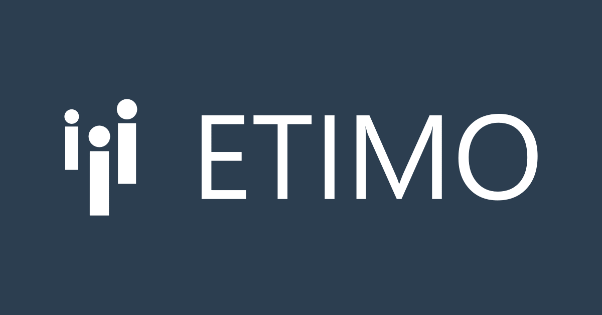

Nu på tisdag, den 2/4, är det dags för Etimo att ta äntra golvet i C4 för att bjuda D-sektionen på både mat och prat!

Etimo är ett Stockholmsbaserat konsultföretag som utvecklar skräddarsydda digitala lösningar till ledande organisationer. Under föreläsningen kommer de inte bara att presentera vad de själva kallar för Sveriges bästa arbetsplats, utan de dyker även ner i ämnet kvantkrypto. Dessutom kommer de tala om den kodtävling som annonserades via Näringslivsutskottet tidigare i veckan, där priser till ett värde av 15 000 kr ligger i potten.

Tid: Tisdag 2/4 kl. 12:15 Plats: C4 Anmälan via: [https://forms.gle/EndEfTbSYaqTFqCA6](https://forms.gle/EndEfTbSYaqTFqCA6)

Evenemanget på Facebook: [https://www.facebook.com/events/511069729423825/](https://www.facebook.com/events/511069729423825/)
