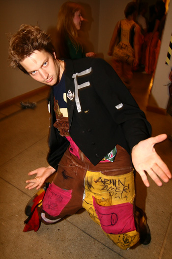
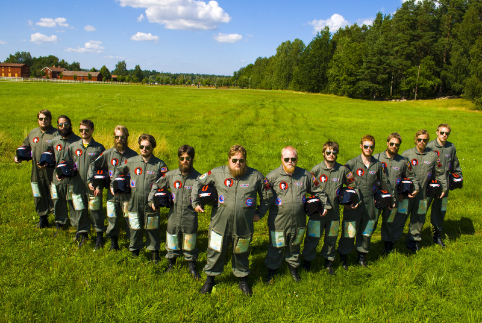

Namn: Josef Hederström Program: D Examensår: 2010

\--

## Vad jobbar du med?

Jag är konsultchef på Alten, ett konsultbolag med 1300 anställda i Sverige.

## 

<!--more-->

## Hur ser en vanlig arbetsdag ut?

Jag har ingen kontakt med teknik utan jag arbetar enbart med människor. Brukar åka till mina kunder och prata om vad de har för behov av hjälp samt genomföra en hel del intervjuer. Samtidigt har jag mitt egna team av konsulter att ta väl hand om, det är det viktigaste! Problemlösning, fast utan teknik utan med konsulter som hjälpmedel.

## Roligast under/roligaste historien från studietiden?

Jag var med i forte, hg, cavagruppen, d-group, sektionen, staben och en hel del mer... Allt man gjorde utöver studierna!

## Vad är det bästa med att arbeta på ditt jobb?

Jag har vart här sedan examen just för jag trivs så bra, har fått och får många erbjudanden om andra jobb men Alten har en tydlig inriktning på att all personal skall må bra och göra det dem vill - därför har jag gjort massor av olika uppdrag som konsult och är nu chef. För jag vill!

## Roligaste dagen på jobbet?

När jag gjorde en riktigt snygg manöver mot min konkurrent och satte en affär framför näsan på honom, med hans egen personal!

## Övrig hälsning, tips eller annat du vill förmedla?

HA KUL! Det är det enda som är viktigt! Det spelar ingen roll om du har en femma i Linalg, viktigaste är att du gör det du brinner för både under studierna och i arbetslivet. Vi jobbar stenhårt med drivkraft, för när du gör det som du brinner för så kommer du prestera otroligt mycket bättre! Engagera dig, ha skoj och skicka ett mail när du behöver ett jobb i Göteborg - jag gillar LiU!

