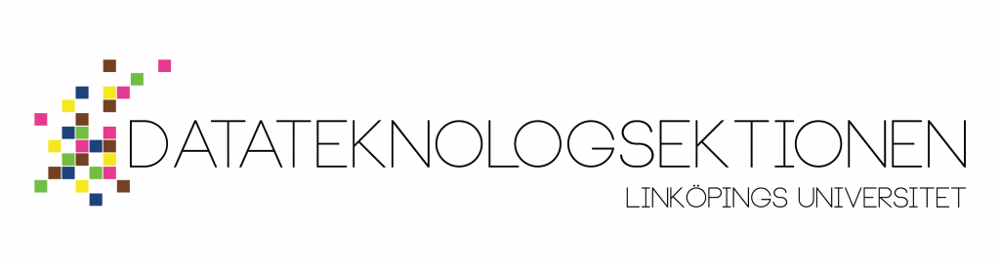

Hej till dig som är nyantagen student till programmen i Datateknik (D), Mjukvaruteknik (U), Informationsteknologi (IT) eller Innovativ Programmering (IP) vid Linköpings universitet!

Först och främst, stort grattis (glöm inte att tacka ja till antagningsbeskedet!) och varmt välkommen!

Din tid tillsammans med oss i D-sektionen kommer att inledas med mottagningsperioden som börjar den 20:e augusti. Under denna period kommer du få lära dig en massa om vår sektion och universitetslivet (och få träffa och ha kul med många härliga människor). Men det finns mycket viktigt och nyttigt som kan vara bra att veta redan nu.

På sidan [Ny student](https://d-sektionen.se/sokande/) har vi samlat bra information kring utbildningen, bostad och mycket mer. Mer info om mottagningsperioden och annat viktigt kommer snart, så håll utkik.

Följ oss också gärna i våra [sociala medier](https://d-sektionen.se/socialamedier/) för uppdateringar och ytterligare inblickar kring vad vi gör inom sektionen när terminen drar igång.

Vi hoppas att du ser fram emot att få börja på ditt nya program, och att du kommer trivas under din tid här med oss i D-sektionen.

Vi syns i höst!
