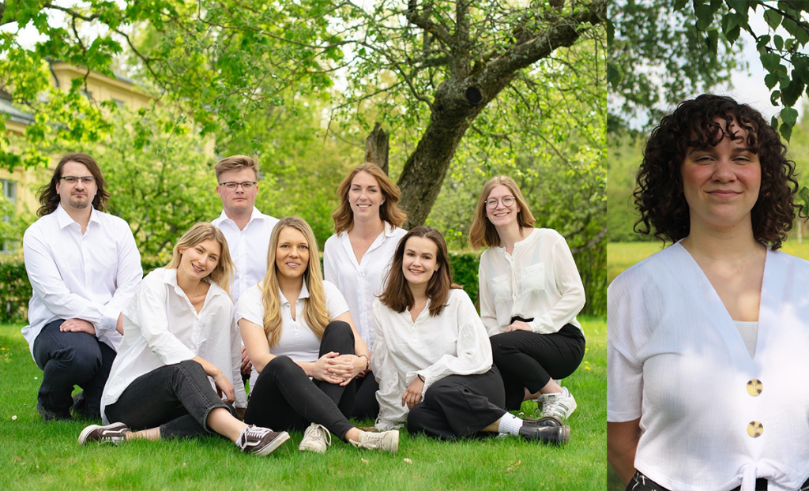

_Datateknologsektionens styrelse 19/20_

 

Hej, alla nya studenter på D-sektionen vid Linköpings universitet!

Imorgon tisdag 20/8 inleds er tid här med oss. Klockan 07:15 på Kryddbodtorget i Gamla Linköping kommer ni att få träffa alla de andra nya studenterna på sektionen, samt vårt festeri D-Group som kommer leda er rätt inledningsvis under dagen. Mer info och komplett schema för introduktionsveckorna hittar du bäst på [staben.info](http://staben.info).

På bilden (bilderna) ser ni sektionens styrelse. Om ni redan nu är nyfikna på vilka de, eller filurerna i D-Group ni kommer träffa imorgon bitti, är så kan ni kika i er Nollehandbok som innehåller en massa nyttig information som kommer vara till stor hjälp under er första tid här.

Introduktionsveckorna är en fantastisk möjlighet att lära sig mer om universitetslivet och vår sektion samtidigt som man skaffar sig en massa nya vänner, så vi hoppas ni är lika spända som vi är på att dra igång!

Vi ses!
