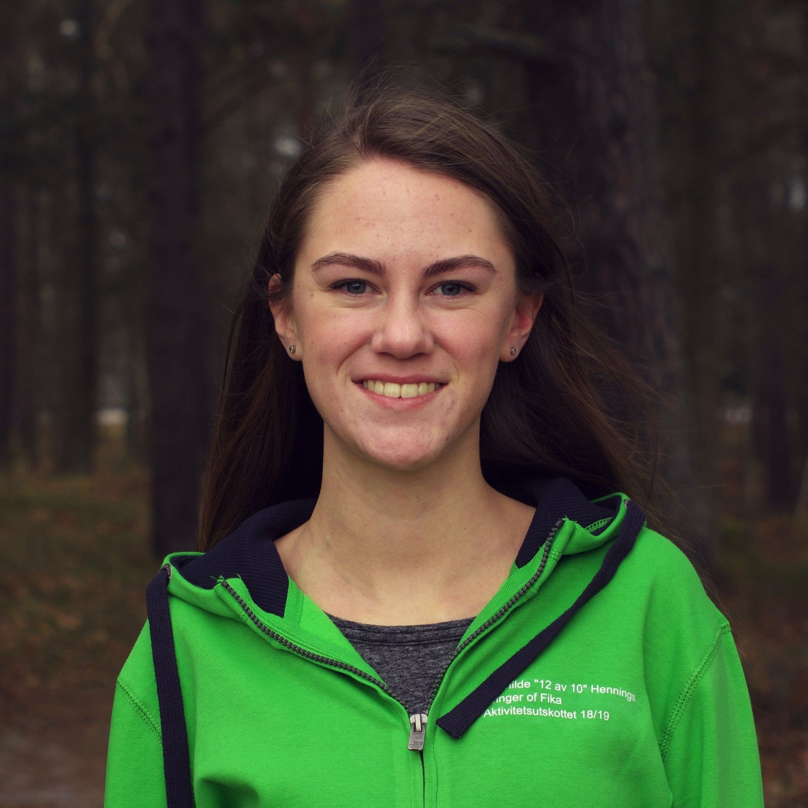

Det är inte alltid lätt att ha koll på vad alla våra rekryterande utskott gör, och varför du bör söka till dem. Därför har vi pratat med de olika utskottens ordförande för att få veta mer. Först ut är AktU, en del av [Aktivitetsutskottet](https://d-sektionen.se/aktivitetsutskottet/).

Mer information kring ansökan och kontaktpersoner för samtliga rekryterande utskott och grupper finns på [d-sektionen.se/ansok](http://d-sektionen.se/ansok). Om du vill söka till AktU direkt kan du göra så via följande [formulär](https://docs.google.com/forms/d/e/1FAIpQLScnlfrGMSdf81CbwlpgwFI2qMwv4D0BEFrlS8AvsFmkzW-9Hg/viewform).

* * *

### Hej! Vem är det jag pratar med?

Hej! Jag heter Mathilde och är ordförande för AktU.

### Kul att få prata med dig, Mathilde! Så vad gör egentligen AktU?

Vi håller i en mängd olika aktiviteter för sektionen, allt möjligt från sport till sittningar. Vad vi anordnar under året beror till stor del på vad vi själva vill anordna och därmed kan det bli en härlig blandning av aktiviteter! Tidigare år har AktU anordnat laserdome, skidresa, retro- och brädspelskvällar, fotboll och innebandy samt sittningar av olika slag, för att nämna några exempel.

<!--more-->

### Ni verkar göra ganska mycket i AktU! Men varför ska man söka sig till er?

Tycker man aktiviteter är kul och vill hjälpa till att anordna många olika typer av evenemang är AktU perfekt! Det finns även stora möjligheter att starta någon ny aktivitet som inte anordnats tidigare om man är taggad på det. Som bonus får man även uppleva hur det är att vara sektionsaktiv och hur utskott fungerar. 

### Vilka egenskaper tror du är bra att ha om man ska vara med i AktU?

Det är definitivt bra om man är driven, idérik och gillar att ta på sig ansvar. Sen uppskattar vi såklart om man är en glad och positiv person och att man har viljan att engagera sig i sektionen.

### Att vara glad är ju bra. Hur mycket arbete innebär det att vara med?

Det varierar periodvis hur mycket vi har att göra och det beror på hur många aktiviteter vi anordnar samt hur mycket planering som krävs kring dessa. I regel blir det så mycket arbete du gör det till eftersom det är upp till dig hur mycket ansvar du tar på dig och hur mycket tid du vill lägga.

### Något mer du vill tillägga?

SÖK, det blir kul!

* * *

Om du vill söka till AktU kan du göra så via följande [formulär](https://docs.google.com/forms/d/e/1FAIpQLScnlfrGMSdf81CbwlpgwFI2qMwv4D0BEFrlS8AvsFmkzW-9Hg/viewform).

För mer info, håll utkik efter inspirationsföreläsningen och rekryteringspuben den 18/9 (se [D-sektionens kalender](https://d-sektionen.se/kalender/)) där ni kommer få möjlighet att lyssna till och träffa samtliga rekryterande utskott.
