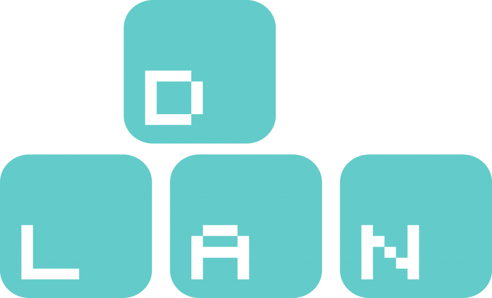

Dags för D-LAN, ett projekt inom [Aktivitetsutskottet](https://d-sektionen.se/aktivitetsutskottet/), att presentera sig.

Mer information kring ansökan och kontaktpersoner för samtliga rekryterande utskott och grupper finns på [d-sektionen.se/ansok](http://d-sektionen.se/ansok). Om du vill söka till D-LAN direkt kan du göra så via följande [formulär](https://docs.google.com/forms/d/1Q8XlBDJiPn_X77n0mrQV3J28SEUlwoos0daZFqfwVps/viewform).

* * *

### Hej! Vem är det jag pratar med?

Hejsan! Jag heter Juliette och är projektledare för D-LAN 2020. Jag har precis påbörjat mitt fjärde år på D och är 22 år gammal. Under mina tidigare år på universitet har jag hunnit engagera mig en del i sektionen, men har nu tagit på mig ansvaret för årets roligaste event, D-LAN.

### Kul! Men vad gör D-LANs projektgrupp?

D-LANs projektgrupp anordnar LiUs största LAN, D-LAN! Projektgruppen ansvarar för att allt ska vara redo när D-LAN går av stapeln och för att allt ska gå smidigt under LANets gång. Detta innebär en hel del olika arbetsuppgifter, allt från att boka lokaler, skriva sponsorkontrakt och gör affischer till att rigga, dra el och hålla i lunchtävlingar.

<!--more-->

### Varför tycker du man ska söka till D-LAN?

Jag tycker att man ska söka D-LAN om man vill engagera sig i ett roligt projekt och vill jobba mot ett tydligt mål, att gör D-LAN 2020 så bra som möjligt. D-LAN är ett bra engagemang om man vill testa på att ha ett eget ansvarsområde, vill vara med och planera och driva event, gillar LAN, eller bara vill ha kul och träffa nya människor. D-LAN är ett evenmang med mycket utvecklingsmöjligheter och chanser för projektmedlemmarna att göra det som de tycker verkar kul. Dessutom får man som projektmedlem ett tydligt mål att jobba emot och sedan se det arbete man gjort förverkligas, vilket är en galen känsla!

### Kan tänka mig att det är en speciell känsla! Vilka egenskaper tror du är bra att ha om man ska vara med i D-LAN?

Att man är glad, positiv och taggad på att göra ett bra jobb. Det krävs inga förkunskaper för att vara med i D-LAN men det är ett plus om man har erfarenheter av sitt specifika ansvarsområde, alternativt vill lära sig massor under projektets gång! Det är bra om man gillar att jobba i grupp, diskutera och bolla idéer.

### Hur mycket arbete skulle du säga att det innebär att vara med?

Planeringen inför D-LAN pågår i 5 månader. Hur mycket tid man väljer att lägga på arbete beror på hur mycket utöver det som krävs man är villig att göra. Under planeringstiden kommer vi ha möte med projektgruppen en gång i veckan och någon timme utöver det kommer krävas för arbete inom ditt ansvarsområde. Arbetet blir mer intensivt ju närmare LANet vi kommer, men också roligare då man ser allt komma på plats.

### Låter verkligen spännande att vara med. Något mer du vill tillägga om D-LAN?

Om man har frågor är man jättevälkommen att kontakta mig via mail ([projektledare@d-lan.se](mailto:projektledare@d-lan.se)) eller genom att bra komma fram och prata. Annars är det enda jag har att säga: TAGGA D-LAN  

* * *

Om du vill söka till D-LAN kan du göra så via följande [formulär](https://docs.google.com/forms/d/1Q8XlBDJiPn_X77n0mrQV3J28SEUlwoos0daZFqfwVps/viewform).

För mer info, håll utkik efter inspirationsföreläsningen och rekryteringspuben den 18/9 (se [D-sektionens kalender](https://d-sektionen.se/kalender/)) där ni kommer få möjlighet att lyssna till och träffa samtliga rekryterande utskott.
