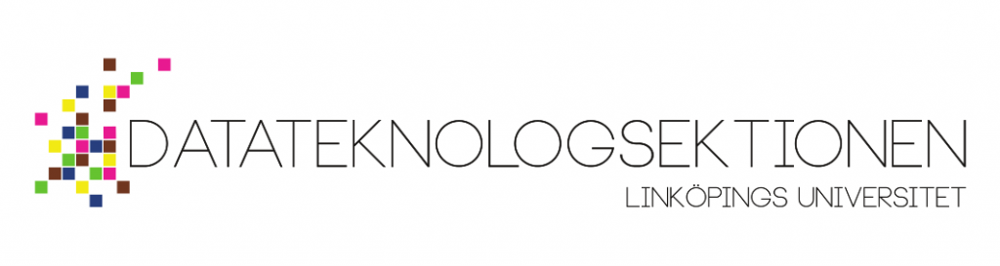
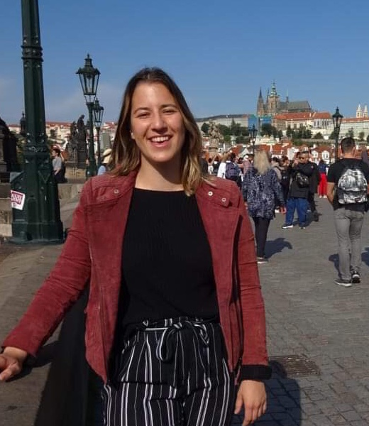

Tiden är inne för [Marknadsföringsutskottet](https://d-sektionen.se/marknadsforing/), även kallat MafU, att presentera sig.

Mer information kring ansökan och kontaktpersoner för samtliga rekryterande utskott och grupper finns på [d-sektionen.se/ansok](http://d-sektionen.se/ansok). Om du vill söka till Marknadsföringsutskottet direkt kan du göra så via följande [formulär](https://docs.google.com/forms/d/e/1FAIpQLSfL06-PaAfpHP5YlMakL7fT0TYLgI52bkZMczuIUgBnthSZCg/viewform).

* * *

### Hej! Vem är det jag pratar med?

Jag heter Rosanna Isaksson och är ordförande för Marknadsföringsutskottet 19/20!

### Trevligt att råkas! Vad gör Marknadsföringsutskottet?

Marknadsföringsutskottets främsta mål är att få fler gymnasieelever att söka sig till Datateknologssektionens utbildningar. Detta försöker vi uppnå genom att synas på mässor/event, hålla i hemmissionering, skugga studenter och dessutom genom att arrangera D-TOUR!

<!--more-->

### Att locka fler till våra utbildningar är ju verkligen superviktigt. Varför bör man söka att bli del av Marknadsföringsutskottet?

Man bör söka sig till Marknadsföringsutskottet om man vill lära känna massa nya människor, utvecklas personligt och dessutom för att ha kul!

### Vilka egenskaper tror du är bra att ha om man ska vara med i din grupp?

Alla människor med olika egenskaper behövs men det viktigaste är att man är ansvarstagande, engagerad och har en positiv inställning! Utöver får man jättegärna vara idérik och komma på nya event till hur vi ska nå ut till gymnasieeleverna.

### Hur mycket arbete skulle du säga att det innebär att vara med?

Det varierar ganska mycket beroende på var vi befinner oss under årets gång. Till exempel är det mer förarbete och planering inför D-TOUR på hösten, medan på våren är vi ganska fria och har själva möjlighet till att arrangera event.

### En blandning av både tydligt bestämt och mer flexibelt arbete, låter spännande! Något mer du vill tillägga?

SÖK, DET BLIR KUL!

* * *

Om du vill söka till Marknadsföringsutskottet kan du göra så via följande [formulär](https://docs.google.com/forms/d/e/1FAIpQLSfL06-PaAfpHP5YlMakL7fT0TYLgI52bkZMczuIUgBnthSZCg/viewform).

För mer info, håll utkik efter inspirationsföreläsningen och rekryteringspuben den 18/9 (se [D-sektionens kalender](https://d-sektionen.se/kalender/)) där ni kommer få möjlighet att lyssna till och träffa samtliga rekryterande utskott.
