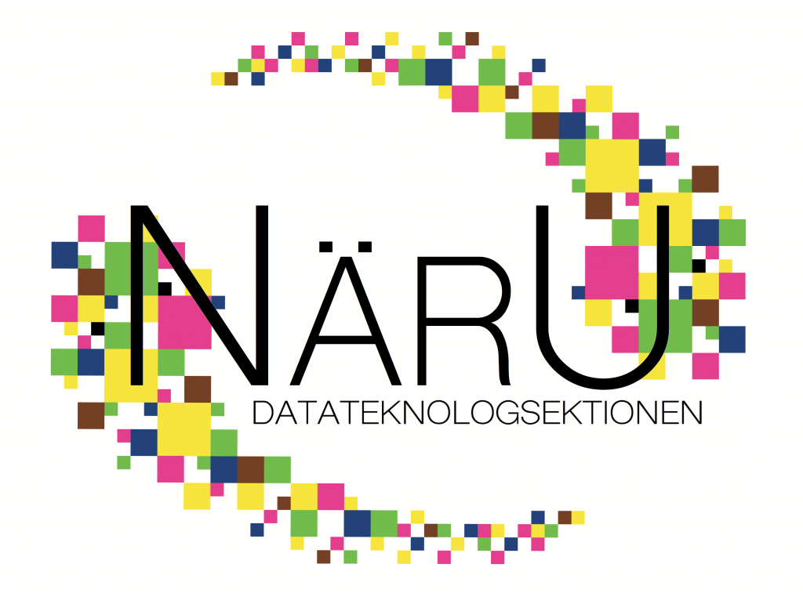

Nu är det dags för nästa presentation, den här gången av [Näringslivsutskottet](https://d-sektionen.se/naringsliv/), även känt som NärU, där vi fått prata med utskottets ordförande och tillika Näringslivsansvarig.

Mer information kring ansökan och kontaktpersoner för samtliga rekryterande utskott och grupper finns på [d-sektionen.se/ansok](http://d-sektionen.se/ansok). Om du vill söka till Näringslivsutskottet direkt kan du göra så via följande [formulär](https://docs.google.com/forms/d/e/1FAIpQLSfh8FZD8kxAtfN5YExUKm6bAbQl8SiqGrHnudt0q2WRQEjn1Q/viewform).

* * *

### Hej! Vem är det jag pratar med?

Hej! Mitt namn är Jakob Sjöqvist och jag är näringslivsansvarig och pluggar tredje året på datateknik. Ursprungligen kommer jag från Karlstad men efter ett år inom Cloud-sfären efter gymnasiet tog jag mitt pick och pack och flyttade till Linkan. Ett av mina bättre beslut då lärt mig massor av nya saker och lärt känna en massa sköna- och duktiga människor, framförallt via NärU.

### Härligt att höra! Så vad gör NärU?

Näringslivsutskottet arbetar med att bygga relationer med företag och organisationer som kan hjälpa sektionens medlemmar ut i arbetslivet, inte bara efter examen utan detta innefattar också t.ex. internships/sommarjobb samt ex-jobb.Vi arrangerar lunchföreläsningar, casekvällar och annat spännande i samarbete med företag.

<!--more-->

### Varför tycker du man ska söka till NärU?

Gillar man att knyta nya kontakter både inom sektionen och näringslivet eller tycker att det skulle vara spännande med att sköta relationen mellan företag och D-sektionen så är NärU helt klart det bästa man kan söka. Här kan man prova sina idéer, utveckla affärsmannaskap och vara med att genomföra många spännande events samtidigt som du har möjlighet att samla massor av mingelpoäng!

### Vilka egenskaper tror du är bra att ha om man ska vara med i NärU?

Man ska vara lite orädd, samt nyfiken på företag som vill samarbeta med oss. Är du även taggad på att hjälpa till att dela ut mat innan föreläsningar och bära sushilådor från Blå Havet är NärU utskottet för dig. Men framförallt ska man vara villig att utvecklas och ha kul!

### Bära sushilådor säger man ju inte nej till! Hur mycket arbete skulle du säga att det innebär att vara med?

Man bestämmer rätt mycket själv, men målet är att alla medlemmar i utskottet ska hantera två-tre företag som man är med och gör några få events med per år. Vi gör mycket tillsammans, och framförallt så hjälps vi åt att arrangera våra evenemang. Någon enstaka timme i veckan, vilket inkluderar lunchmöte, kommer man långt på när alla hjälps åt!

* * *

Om du vill söka till Näringslivsutskottet kan du göra så via följande [formulär](https://docs.google.com/forms/d/e/1FAIpQLSfh8FZD8kxAtfN5YExUKm6bAbQl8SiqGrHnudt0q2WRQEjn1Q/viewform).

För mer info, håll utkik efter inspirationsföreläsningen och rekryteringspuben den 18/9 (se [D-sektionens kalender](https://d-sektionen.se/kalender/)) där ni kommer få möjlighet att lyssna till och träffa samtliga rekryterande utskott.
