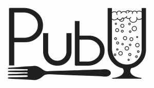
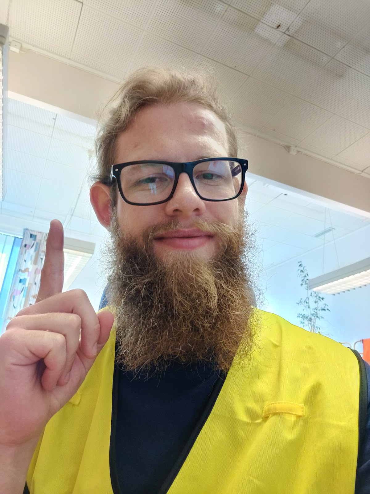

Känner ni doften? Mmm...tror det minsann är hög tid att låta sektionens i särklass mest kulinariska utskott, Pubutskottet, presentera sig.

Ni har väl inte heller missat den allra första D-Pub: Rekryteringspuben, som kommer äga rum onsdag 18/9 från kl. 15 i Gasquen? Där får ni träffa representanter från alla rekryterande utskott, samt äta och dricka gott! Ett utmärkt tillfälle att se vad Pubutskottet går för, om inget annat!

Mer information kring ansökan och kontaktpersoner för samtliga rekryterande utskott och grupper finns på [d-sektionen.se/ansok](http://d-sektionen.se/ansok). Om du vill söka till Pubutskottet direkt kan du ansöka via följande [formulär](https://docs.google.com/forms/d/e/1FAIpQLSceF97d3ZYQpyXZdMJL3sKMZT7QGNx4XB3TklJr59_8VVb2ew/viewform).

* * *

### Hej! Vem är det jag snackar med?

Tjaba tjena hallå! Du snackar med Dennis Berntsson och jag är ordförande för pubutskottet! Jag är ursprungligen från den soliga staden Borås, men kände att jag behövde lite mer blåst i mitt liv och drog till Linköping, där jag nu pluggar mitt andra år på mjukvaruteknik.

### Man måste ju älska blåsten! Så vad gör Pubutskottet?

D-Pub är en pub dit D-Sektionens medlemmar kan komma för att äta och dricka gott samt njuta av varandras sällskap. Som medlem i pubutskottet är man delaktig i att arrangera dessa underbara pubar. Man lagar mat i Gasquen och säljer öl till törstiga D:are i baren. Utöver att hänga i Gasquen tycker vi även om att umgås med varandra och ses gärna på en kickoff då och då, kanske lagar lite mat och knäpper en kall.

<!--more-->

### Ju mer kall desto mer bra! Varför bör man söka sig till Pubutskottet?

Om du gillar mat, dryck och gott sällskap är detta utskottet för dig. Man får lära sig en hel del nya saker om den kulinariska världen samt skaffar man sig vänner för livet. Det är också fett kul att få vara med och engagera sig för en utav D-sektionens mycket uppskattade event.

### Så vilka egenskaper tror du är bra att ha om man ska vara med?

Att vara driven, hjälpsam och sugen på att testa nya saker skulle jag säga är det viktigaste. Sen att kunna hacka ett berg av lök med en glad min och tårfyllda ögon är värt lökens vikt i pluspoäng. Men i slutändan handlar allt om en bra attityd och viljan att engagera sig!

### Hur mycket arbete skulle du säga att det innebär att vara med?

Pubarna sker en gång i månaden och inför dessa behöver det planeras lite, vi har därför lunchmöte en gång i veckan med avstämning, diskussion kring vilken mat som skall serveras och uppgiftsfördelning. Dagen innan puben åker vi och handlar maten och ser till att vi har allting, sen kommer den stora dagen, då vill vi gärna att man är på plats och köttar på i gasquenköket. Så utöver själva pubdagen är det ett chill lunchmöte i veckan som gäller.

### Kan ju påpeka att även fast det köttas på ordentligt i köket så serverar ni även vego. Något mer du vill tillägga?

PubU letar efter att utöka familjen! Häng med familjen på en livstids resa genom gasquenkökets soliga havsutsikt!

* * *

Om du vill söka till Pubutskottet kan du göra så via följande [formulär](https://docs.google.com/forms/d/e/1FAIpQLSceF97d3ZYQpyXZdMJL3sKMZT7QGNx4XB3TklJr59_8VVb2ew/viewform).

För mer info, gå på inspirationsföreläsningen och rekryteringspuben den 18/9 (se [D-sektionens kalender](https://d-sektionen.se/kalender/)) där ni kommer få möjlighet att lyssna till och träffa samtliga rekryterande utskott.
