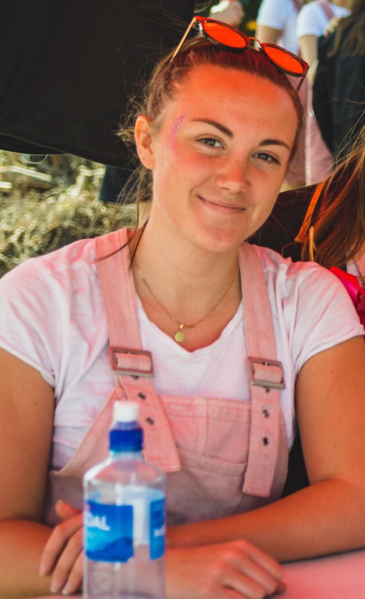

Är ni (val)beredda på att få lära er mer om Valberedningen? Kul, för här kommer en presentation som förhoppningsvis ska ge er lite mer kött på benen om just Valberedningen!

Mer information kring ansökan och kontaktpersoner för samtliga rekryterande utskott och grupper finns på [d-sektionen.se/ansok](http://d-sektionen.se/ansok). Om du vill söka till Valberedningen direkt kan du ansöka via följande [formulär](https://forms.gle/ESGKYbDLGWe1K2GdA).

Detta är den sista presentationen! Läs samtliga presentationer via följande [länk](https://d-sektionen.se/kategori/presentation-av-utskott-ht19/), och hitta vilka utskott du skulle vilja söka.

* * *

### Hej! Vem är det jag pratar med?

Hejhej! Mitt namn är Lovisa Stålebrink och sitter just nu som ordförande i Valberedningen. Jag är en 21 årig smålänning som pluggar mitt tredje året på datateknik.

### Vad gör Valberedningen?

Valberedningens uppgift är att ta ut lämpliga kandidater till de olika förtroendeposterna, så som styrelseposterna på sektionen samt utskottsordföranden och kassörer. I stora drag handlar det mycket om att intervjua de som sökt posterna och sedan tillsammans i utskottet komma överens om vilka som lämpar sig bäst för de olika posterna. Dessa nomineras sedan till våra tre olika sektionsmöten: höst-, vinter- och vårmötet där sektionen har sista ordet om de ska väljas in eller inte.

<!--more-->

### Intervjuer är verkligen kul! Så varför bör man söka sig till Valberedningen?

Som medlem i Valberedningen får man en bred syn på hur de olika utskotten på sektionen arbetar och vad som krävs för respektive post. Man har även stor chans att påverka vilka som styr sektionen kommande läsår.

Intervjuer och intervjutekniker är något som man lär sig mycket om som sittande i Valberedningen och som är väldigt bra att ha med sig när man ska ut i arbetslivet eller bara vill söka någon annan post på sektionen. Det är även väldigt roligt att sitta på andra sidan på en intervju. 

Så låter det intressant, då ska man definitivt söka Valberedningen!

### Det låter intressant. Så vilka egenskaper tror du är bra att ha om man ska vara med?

Man ska vara nyfiken och vilja lära sig mer om vad de olika utskotten på sektionen arbetar med. Det kan också vara bra att ha gått på lite olika event som anordnas av utskott på sektionen då man får en bra bild av vilka kompetenser som behövs för en specifik post. Man lär sig mycket under tiden som sittande i Valberedningen, så viktigast av allt skulle jag ändå säga är att man ska vara taggad och vara villig att utvecklas!

### Hur mycket arbete skulle du säga att det innebär att vara med?

Det är lite olika. Vissa perioder, speciellt inför sektionsmöten, så är det självklart lite mer att göra då intervjuer ska hållas och kandidater ska väljas ut. Då kan det vara något extra kvällsmöte någon vecka och sen lite tid som går åt till intervjuer. Tiden däremellan så är det mest förberedelser inför kommande sektionsmöten med vanligtvis ett lunchmöte i veckan.

### Nu känner jag mig verkligen (val)beredd att söka! Något mer du vill tillägga?

Har man någon fråga så är man mer än välkommen att maila mig på val@d-sektionen.se. Annars säger jag bara: Söök!! Det kommer bli redit skoj!

* * *

Om du vill söka till Valberedningen kan du göra så via följande [formulär](https://forms.gle/ESGKYbDLGWe1K2GdA).

Samtliga presentationer finns nu att läsa via följande [länk](https://d-sektionen.se/kategori/presentation-av-utskott-ht19/). Ansökningsperioden pågår till och med den 22/9, så in och sök!
