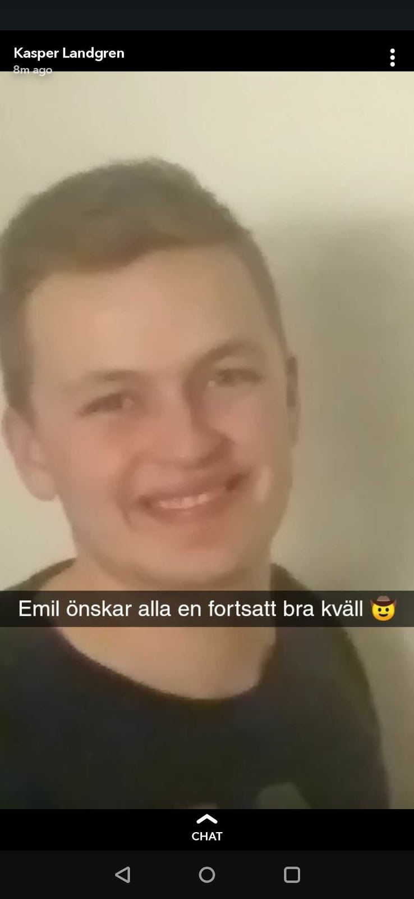

Nu är det dags för gruppen som ser till att hemsidan och våra övriga webbtjänster fungerar som de ska att presentera sig, nämligen Webbgruppen!

Mer information kring ansökan och kontaktpersoner för samtliga rekryterande utskott och grupper finns på [d-sektionen.se/ansok](http://d-sektionen.se/ansok). Om du vill söka till Webbgruppen direkt kan du ansöka via följande [formulär](https://docs.google.com/forms/d/e/1FAIpQLSdCgA7l2ot6hzsUThxUjit_f23178GfEc35K1BApI3s6YQTSg/viewform).

### Hej! Vem är det jag pratar med?

Hej! Jag heter Emil och pluggar tredje året på mjukvaruteknik. Jag är webmaster i D-sektionen under läsåret 19/20.

### Cool titel! Berätta om Webbgruppen!

Vår uppgift är att utveckla och underhålla sektionens hemsidor. Detta innebär att vi gör allt från att underhålla sektionens virtuella Linux server, till att utveckla våra hemsidors design. Exempel på vad vi skapat de senaste åren är ett röstningssystem, ett bilbokningssystem, ett infomailsystem, ett blippsystem, med mera.

<!--more-->

### Varför bör man söka till Webbgruppen?

Om man gillar webbutveckling och vill lära sig mer om det är webbgruppen en bra möjlighet att få prova på att arbeta tillsammans med andra i ett projekt eller få chansen att hitta på något eget man vill bidra med. Sen blir man såklart sektionsaktiv och på det viset får man lära känna många nya människor.

### Vilka egenskaper tror du är bra att ha om man ska vara med?

Huvudsaken är att man har en vilja att hjälpa till och en vilja att lära sig mer. Det hjälper såklart också att ha tidigare erfarenhet och vara en duktig webbutvecklare/programmerare, men det är absolut inget krav.

### Låter som att det finns utrymme att lära sig mycket. Hur mycket arbete skulle du säga att det innebär att vara med?

Det huvudsakliga arbetet kommer ske på våra kodkvällar där vi en kväll i veckan under terminstid träffas, diskuterar hur arbetet går och jobbar vidare med våra projekt.

### Kul. Något mer du vill tillägga?

Nej.

### Okej.

* * *

Om du vill söka till Webbgruppen kan du göra så via följande [formulär](https://docs.google.com/forms/d/e/1FAIpQLSdCgA7l2ot6hzsUThxUjit_f23178GfEc35K1BApI3s6YQTSg/viewform). Ansökningsperioden pågår till och med den 22/9, så in och sök!
