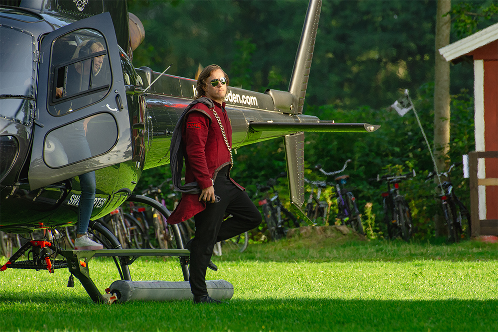
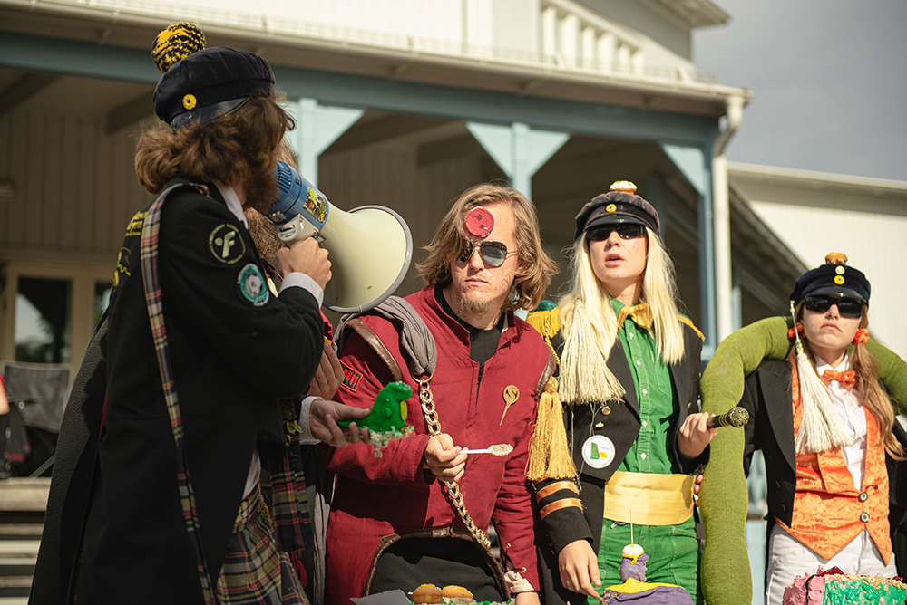

Hej hopp!

Såhär dagarna innan möjligheten till att ansöka general till STABEN 20/21 stänger så har det intervjuats med årets general! Läs och inspireras!

* * *

<figure>

<figcaption>

Foto: [Cecilia Olsson Photography](https://www.facebook.com/ceciliaolssonphotography/)

</figcaption>

</figure>

## Vem är du?

Mitt namn är Carl Magnus Bruhner och jag är en IT student som älskar att engagera mig i och utanför plugget. Sen är jag kunskapstörstig och kan mycket onödigt om onödiga saker!

<!--more-->

## Vad äter du till frukost?

En shake eller inget.

## Vad skulle du vilja vara världsmästare i?

Bästa skäggväxten!

## En sak du skulle ta med dig om du blev fast på en öde ö?

En magisk ande som kan uppfylla tre önskningar.

## Vad innebär en post som general i STABEN?

Det innebär en fantastisk tid med väldigt mycket arbete och massa kul med härliga människor. Samtidigt som man gör något stort och bra för universitetet så får man hitta på roliga saker och lära känna många över sektionsgränsen.

<figure>

<figcaption>

Foto: [Cecilia Olsson Photography](https://www.facebook.com/ceciliaolssonphotography/)

</figcaption>

</figure>

## Vad har varit roligast under ditt år i STABEN?

Andra veckan på mottagningen! Allt ballar ur och alla bara driver med varandra. Lätt övertrött och arbetar bara för att få alla andra att skratta mellan olika fadderier.

## Varför ska man söka posten som general?

Dels för att man är taggad på att göra mottagningen och att vara fadderist! Men också för att utveckla sitt ledarskap själv och med andra generaler, ibland i pressade situationer och ibland bollar man idéer med andra generaler.

## Behöver man några tidigare erfarenheter för att söka posten som general?

Det är bra med tidigare ledarerfarenheter och man bör definitivt varit engagerad i mottagningen på något sätt som man vet vad den innebär.

## Hur mycket tid la du ner per vecka ungefär på ditt arbete med STABEN?

Varierar mycket, som general måste man vara beredd att ha tid att lägga men att man kanske inte alltid lägger tiden för någon kan behöva hjälp eller inte behöva hjälp. Om allt funkar bra så resulterar det i en lättare vecka tidsmässigt. Men på ett ungefär så har det kanske varit 10-20 timmar. Värst var veckorna med stassen, då det var det minst 40 timmar!

* * *

Tror du att generalposten i STABEN 20/21 skulle vara något för dig? Då borde du snabbare än snabbast skicka iväg en ansökan via [följande länk](https://forms.gle/fxTw54XCjCXC8iUXA) innan det är för sent! Ansökan är öppen fram till 23:59 den 20 oktober.

Har du en kompis som är utav det tokfinaste generalmaterialet? Då kan du nominera kompisen via [följande länk](https://forms.gle/9HW7RAPQrYzNDs878) jättefort!
